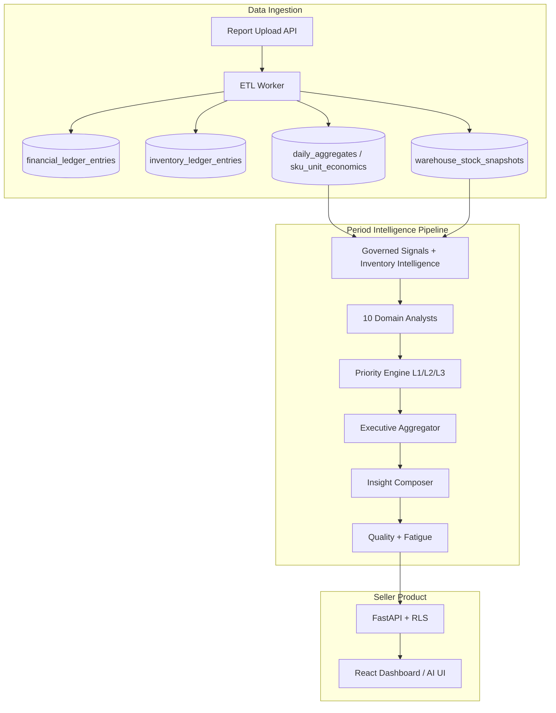

# Marketplace Analytics Platform (WB / Ozon)

**Version:** Phase 9.7-B (trust UX pilot validation) · Phase 9.7-A (backend trust hardening) · Phase 9.6B-3 (trust UX)  
**Certified baseline:** git tag `certified-production` → `ed9ede1`  
**Frontend bundle (production):** `index-CZkr1sTA.js` @ 2026-07-11  
**Alembic head:** `0035_registration_invites`  
**Status:** Trust UX validated (FULL + INSUFFICIENT live) · Hub readiness 76/100 · Conditional GO for 9.7-C  
**Last updated:** 2026-07-11

---

## Current Production Release

| Field | Value |
|-------|-------|
| **Certified baseline (VPS)** | git tag `certified-production` → `ed9ede1` (Phase 9.7-A) |
| **Frontend bundle** | `index-CZkr1sTA.js` @ 2026-07-11 |
| **Phase 9.7-A certification** | [docs/release/phase_97a_deployment_certification.md](docs/release/phase_97a_deployment_certification.md) |
| **Phase 9.7-B validation** | [docs/product/trust_ux_validation_report.md](docs/product/trust_ux_validation_report.md) |
| **Phase 9.6B-3 certification** | [docs/release/phase_96b3_deployment_certification.md](docs/release/phase_96b3_deployment_certification.md) |
| **Phase 9.6B-2A certification** | [docs/release/phase_96b2a_deployment_certification.md](docs/release/phase_96b2a_deployment_certification.md) |
| **Historical safety baseline** | `11731e9` — 8.2.1a recovery stabilization |
| **Safety stack** | 8.2.0 systemd preflight · 8.2.1a recovery tooling · 8.3.0 deploy guard |
| **Feature release tag** | `v8.1-promotion-expenses-mvp` |
| **Auth phases** | 9.1A gate · 9.2B roles · 9.2C admin panel · 9.3A invites |
| **Phase 8.1 manifest** | [docs/release/phase_81_production_release.md](docs/release/phase_81_production_release.md) |
| **Safety docs** | [docs/operations/production_safety.md](docs/operations/production_safety.md) |
| **Recovery runbook** | [docs/operations/production_recovery_runbook.md](docs/operations/production_recovery_runbook.md) |

**Host:** `321997.fornex.cloud` · **Certification:** Production = Workspace · CI GREEN · AI VALIDATED

Pilot KPIs (2026-06-29 — 2026-07-05): Settlement Profit **100 530.15 ₽** · Promotion **9 925 ₽** · Profit After Promotion **90 605.15 ₽** · Impact **9.87%**

---

## Project Overview

Multi-tenant SaaS platform for Wildberries and Ozon sellers: deterministic financial and inventory analytics, seller-facing dashboard, and **advisory AI** (Period Intelligence).

The platform treats marketplace reports as a **financial data platform** — not a one-off Excel parser:

- **Append-only ledgers** (finance + inventory) as source of truth
- **Governed projections** (aggregates, snapshots) — rebuildable, not authoritative
- **PostgreSQL RLS** — strict tenant isolation
- **AI is advisory only** — never mutates ledgers; degrades confidence when data is incomplete

**Stack:** FastAPI · PostgreSQL 16 (Supabase in production) · Async SQLAlchemy 2.0 · Alembic · React (Vite) · ETL worker · Runtime orchestrator · Optional LLM provider (OpenAI-compatible)

**Primary workflows:**

1. Upload WB realization report (`.xlsx` / `.csv`)
2. ETL → ledger → aggregates → inventory snapshots
3. Import COGS (`cost_history`) for margin/profit trust
4. Enter **promotion expenses** per report (Reports UI or `PATCH /api/v1/reports/{id}`)
5. Dashboard shows **Profit After Promotion** as primary profit KPI
6. Period Intelligence AI run → executive summary + actionable recommendations (promotion-aware snapshot)
7. Seller actions: accept / dismiss / complete / snooze

---

## Product Vision

**AI Operational Director for marketplace sellers** — a system that answers:

> *What happened in this period? Why? What should I do first?*

Not a chatbot over raw KPIs. The product combines:

- **Deterministic domain analysts** (revenue, profit, logistics, inventory, …) on governed data
- **Executive Summary** — one primary insight + supporting leads, business-oriented order
- **Business Coverage** — honest disclosure of what data the AI can and cannot see
- **Trust gating** — profit/margin hidden or downgraded when COGS coverage is incomplete
- **Measurable quality** — Seller Usefulness, AI Readiness, Dashboard Echo, Actionable Rate

**North star:** every recommendation must be **actionable**, **grounded in ledger data**, and **prioritized for seller decisions** — revenue and **profit after promotion** first, inventory escalated only when critical.

---

## Promotion Expenses MVP *(Phase 8.1)*

Manual promotion overlay on WB settlement profit — read-layer adjustment, no ledger mutation.

| Capability | Detail |
|------------|--------|
| **`promotion_expenses`** | Per-report manual field (`reports.promotion_expenses`, migration 0033); default `0` |
| **Profit After Promotion** | Primary seller profit: `(settlement − promotion) − COGS` |
| **Settlement Profit** | Reference only (`seller_profit_raw`) — profit before external promotion |
| **Dashboard KPI** | Finance block shows settlement reference, promotion spend, adjusted profit, impact % |
| **AI integration** | Snapshot fields: `seller_profit_raw`, `promotion_expenses`, `seller_profit_after_promotion`, `promotion_impact_pct`; prompt rules in `PROMOTION_PROFIT_RULES` |
| **PATCH API** | `PATCH /api/v1/reports/{report_id}` with `{ "promotion_expenses": "9925.00" }` |

Domain math: `app/domain/analytics/promotion_adjusted.py`  
UI: `frontend/src/views/reports/PromotionExpensesCell.tsx`, `DashboardPage.tsx`

Full release specification: [docs/release/phase_81_production_release.md](docs/release/phase_81_production_release.md)

## Cost Trust System *(Phase 9.6B-1)*

Backend computes `profit_metrics_trust` from COGS coverage over selling SKUs in the analytics period. The frontend **never derives trust locally** — it normalizes the API contract and gates profit/margin display accordingly.

| Trust level | Coverage | Profit KPI | Margin KPI | Display |
|-------------|----------|------------|------------|---------|
| **`full`** | 100% of selling SKUs have cost | Shown as verified | Shown | Exact values; badge «Проверено» |
| **`partial`** | 1–99% coverage | Shown as estimate | Hidden | Values prefixed with `~`; badge «Оценка»; banner with coverage CTA |
| **`insufficient`** | 0% coverage | Hidden (`—`) | Hidden | Deltas blocked (`н/д`); badge «Нет себестоимости»; banner prompts COGS upload |

**Frontend modules:** `useProfitTrust` (hook + formatters) · `ProfitTrustBadge` · `CostCoverageIndicator` · `CostTrustBanner`

**Integrated surfaces (9.6B-2):** Сравнение периодов · Экономика SKU · SKU drilldown — inline banners, trust badges, gated deltas.

Source: `frontend/src/state/profit-trust.ts`, `frontend/src/ui/profit-trust-badge.tsx`, `frontend/src/ui/cost-coverage-indicator.tsx`, `frontend/src/ui/cost-trust-banner.tsx`  
Architecture: [docs/frontend/frontend_architecture.md](docs/frontend/frontend_architecture.md#phase-96b-2-trust-integration) · Trust docs: [docs/product/cost_trust_system.md](docs/product/cost_trust_system.md)

## Current AI Capabilities

### Revenue Intelligence

- Period revenue, top SKU concentration, period-over-period change
- Findings: `sales_top_sku`, `sales_revenue_present`, `revenue_drop` / `revenue_growth`, `concentration_top1_risk`
- **Primary insight candidate** (L1) when data supports it
- Source: `daily_aggregates`, `sku_daily_metrics`, governed signals

### Profit Intelligence

- **Primary KPI:** Profit After Promotion (settlement minus manual promotion expenses minus COGS)
- **Reference KPI:** Settlement Profit (`seller_profit_raw`) — before promotion overlay
- Margin %, ROI (with COGS trust gating); promotion impact % when expenses > 0
- Findings: `sales_low_margin`, `profit_drop`, deep period insights (unprofitable SKUs)
- Source: `financial_ledger_entries`, `cost_history`, `reports.promotion_expenses`

### Marketplace Cost Intelligence

- Commission, logistics, returns, storage, penalties, deductions
- Findings: `logistics_high_share`, `logistics_share_growth`, `returns_high_rate`, `returns_rate_growth`
- Deep insights: high commission SKUs, logistics-heavy SKUs
- Source: `financial_ledger_entries`, unit economics

### Inventory Intelligence *(Phase 6.3.0)*

Deterministic layer over existing tables — **no new integrations**:

| Insight | Finding ID | Signal |
|---------|------------|--------|
| Dead stock | `inventory_dead_stock` | SKUs with stock, no recent sales |
| Slow movers | `inventory_slow_movers` | Low turnover vs sales velocity |
| Frozen capital | `inventory_frozen_capital` | Stock × unit cost |
| Stock concentration | `inventory_stock_concentration` | Capital tied to few SKUs |
| Inventory risk | `inventory_risk_high` | Composite risk score |

- Intelligence builder: `app/domain/inventory/intelligence.py`
- Analyst: `app/ai/analysts/inventory.py`
- **Escalation to Primary (L1)** only for critical dead stock or frozen capital ≥ 20% of revenue *(Phase 6.3.0B)*
- Otherwise inventory appears as **supporting domain** (L2) in Executive Summary

### Executive Summary Engine

- Composes title, lead blocks (max 3), reasoning from prioritized findings
- **Revenue-protected primary selection** — inventory wins only if IQ > revenue IQ + 8 pp
- Domain-balanced lead order: Revenue → Profit → Logistics → Returns → Inventory (max 1 slot)
- Semantic deduplication — no duplicate inventory meaning across lead slots
- Module: `app/ai/executive/aggregator.py`, `app/ai/insights/composer.py`

### Insight Engine

- **10 domain analysts:** Sales, RevenueChange, Logistics, Returns, Concentration, Ads (stub), Inventory, Funnel, MarketplaceComparison, Anomaly
- Governed signals: `app/ai/analysts/governed_signals.py`
- Deep period insights: `app/ai/deep/period_insights.py`
- Priority levels L1 / L2 / L3: `app/ai/insights/priority_engine.py`
- Output format: Что / Почему / Уверенность / Действие
- Quality + fatigue: `app/ai/product/fatigue.py`, recommendation audit

### Coverage Engine

**Business Coverage V1** (`app/ai/coverage/business_coverage.py`):

| Block | Weight | Status |
|-------|--------|--------|
| Sales | 12 | ✅ ON |
| Marketplace costs | 14 | ✅ ON |
| COGS & margin | 14 | ✅ ON |
| Inventory | 10 | ✅ ON (partial — snapshots from WB finance) |
| Advertising | 12 | ⚠️ Partial — manual `promotion_expenses` (Phase 8.1); no WB Ads API |
| External marketing | 10 | ❌ OFF |
| Tax | 10 | ❌ OFF |
| OPEX | 10 | ❌ OFF |
| Financial expenses | 8 | ❌ OFF |

**Score:** 50% (12+14+14+10) — persisted in `action_plan.business_coverage`, shown in recommendation UI.

---

## Current Metrics

> Historical Phase 6.3.0B pilot audit metrics below. **Phase 8.1 production KPIs** are in [phase_81_production_release.md](docs/release/phase_81_production_release.md#5-production-acceptance-section).

Pilot audit: 4 WB finance reports, user `caefecb3-5789-4878-a9d4-929be573fbcc`  
Audit script: `scripts/phase_630_inventory_audit.py` → `reports/phase_630_inventory_audit.json`

| Metric | 6.2.2 | 6.3.0 | **6.3.0B (current)** | Target |
|--------|-------|-------|----------------------|--------|
| **Seller Usefulness** | 74.1 | 68.2 ↓ | **80.3** | ≥ 74 ✅ |
| **AI Readiness** | 85.7 | 85.3 | **86.1** | ≥ 86 ✅ |
| **Business Coverage V1** | 50% | 50% | **50%** | — |
| **Dashboard Echo** | 0% | 0% | **0%** | 0% ✅ |
| **Actionable Rate** | 100% | 100% | **100%** | 100% ✅ |
| Inventory Insight Rate | 0% | 100% | **100%** | preserve ✅ |
| Inventory Sub-Coverage | 25% | 75% | **75%** | — |
| Primary Insight Quality | 84.2 | 77.5 | **91.2** | — |
| Trustworthiness | 87.5 | 87.5 | **87.5** | — |

**Release decision:** GO — ready for `v0.6-mvp-intelligence` tag.

---

## Architecture Overview


```mermaid
flowchart TB
  subgraph ingest [Data Ingestion]
    Upload[Report Upload API]
    ETL[ETL Worker]
    Ledger[(financial_ledger_entries)]
    InvLedger[(inventory_ledger_entries)]
    Snapshots[(warehouse_stock_snapshots)]
    Agg[(daily_aggregates / sku_unit_economics)]
  end

  subgraph ai [Period Intelligence Pipeline]
    Signals[Governed Signals + Inventory Intelligence]
    Analysts[10 Domain Analysts]
    Priority[Priority Engine L1/L2/L3]
    Exec[Executive Aggregator]
    Composer[Insight Composer]
    Quality[Quality + Fatigue]
  end

  subgraph product [Seller Product]
    API[FastAPI + RLS]
    UI[React Dashboard / AI UI]
  end

  Upload --> ETL
  ETL --> Ledger
  ETL --> InvLedger
  ETL --> Snapshots
  ETL --> Agg
  Agg --> Signals
  Snapshots --> Signals
  Signals --> Analysts
  Analysts --> Priority
  Priority --> Exec
  Exec --> Composer
  Composer --> Quality
  Quality --> API
  API --> UI
```

| Layer | Key modules | Responsibility |
|-------|-------------|----------------|
| **Domain** | `app/domain/finance/`, `app/domain/inventory/` | Money rules, ledger semantics, inventory intelligence |
| **ETL** | `app/etl/worker.py`, `app/etl/wb/` | Parse WB reports, append ledger, rebuild projections |
| **Analytics** | `app/services/analytics_*` | Read APIs, KPI, economics, inventory economics |
| **AI Engine** | `app/services/ai_service.py`, `app/ai/` | Period Intelligence, analysts, executive, persistence |
| **Product** | `app/ai/product/` | Seller usefulness, prioritization, fatigue, today's focus |
| **Frontend** | `frontend/` | Dashboard, reports, costs, AI recommendations |

**Production path:** `AIIntelligenceEngine` via `AIService.run_intelligence`  
**Not in production:** Operating Director scaffold (`app/ai/director/`) — planned Phase 6.3.4

### Production runtime services

| Process | Module / unit | Role |
|---------|---------------|------|
| **API** | `app.main` · `marketplace-backend.service` | FastAPI / uvicorn :8000 |
| **ETL worker** | `app.etl.worker` · `marketplace-worker.service` | Queue consumer, parse → ledger → projections |
| **Orchestrator** | `app.runtime.orchestration_worker` · `marketplace-orchestrator.service` | Rebuild dispatch + maintenance (PostgreSQL lease) |
| **Frontend** | nginx static · `/var/www/marketplace-analytics` | Production UI (Vite build via `deploy-frontend.sh`) |
| **Database** | Supabase Postgres (`ENVIRONMENT_MODE=MAIN`) | RLS, `alembic_version`, ledgers |

Systemd unit files: `deploy/systemd/`. Backend, worker, and orchestrator use **`ExecStartPre`** → `scripts/preflight-env.sh --systemd` before process start.

**Architectural invariants:** [docs/architecture/invariants.md](docs/architecture/invariants.md)  
**Phase 6.3 blueprint:** [docs/ai/phase_63_architecture_blueprint.md](docs/ai/phase_63_architecture_blueprint.md)

---

## Supported Domains

### Implemented (production)

| Domain | Analytics UI | AI Insights | Data source |
|--------|-------------|-------------|-------------|
| Revenue / Sales | ✅ Dashboard, Trends | ✅ L1 primary | WB realization report |
| Profit / Margin | ✅ Economics | ✅ Trust-gated, promotion-adjusted | Ledger + `cost_history` + `promotion_expenses` |
| Promotion expenses | ✅ Reports UI, Dashboard | ✅ Snapshot + prompt rules | Manual per-report PATCH |
| MP costs (commission, logistics, returns) | ✅ Economics, reconciliation | ✅ L1/L2 | Ledger |
| Inventory (stock, frozen capital, risk) | ✅ Inventory economics | ✅ L2 default, L1 escalated | Snapshots + ledger |
| SKU unit economics | ✅ Economics drilldown | ✅ Deep insights | Rebuild projections |
| Anomalies / data quality | ✅ Integrity signals | ✅ Warnings | Reconciliation, drift checks |
| Business Coverage disclosure | ✅ AI detail badge | ✅ Persisted | Coverage V1 engine |

### Roadmap (not implemented)

| Domain | Blocker | Planned phase |
|--------|---------|---------------|
| Advertising (spend, ACOS, DRR) | Manual promotion overlay only (Phase 8.1) | **8.2+** WB Ads auto-import |
| Tax (УСН, НДС) | No import tables | **6.3.2** |
| OPEX (payroll, rent) | No import tables | **6.3.2** |
| Conversion (card views, cart, CTR) | No funnel/import tables | **6.3.3** |
| Operating Director (multi-agent) | Scaffold only | **6.3.4** |
| Ozon parser | Placeholder ETL | Post-6.3 |
| Live WB/Ozon API sync | Not in MVP | Future |

---

## Project Roadmap

### Completed

| Phase | Deliverable | Status |
|-------|-------------|--------|
| **8.1** | **Promotion Expenses MVP** — manual promotion overlay, adjusted profit KPIs, Dashboard, AI snapshot, migration 0033 | ✅ Certified |
| **8.2** | **Production Safety** — preflight CLI, systemd `ExecStartPre`, orchestrator unit, recovery assess | ✅ Deployed (`01cfee9`) |
| **8.2.1a** | **Ops stabilization** — recovery script + `app.ops.preflight` alembic fixes | ✅ Deployed (`11731e9`) |
| **8.3** | **Deploy guard** — dirty-tree + RAM gate in `deploy-frontend.sh` | ✅ Certified *(next frontend deploy)* |
| **9.1A** | **Registration gate** — `REGISTRATION_MODE=invite_only` blocks open signup | ✅ Deployed |
| **9.2B** | **Platform roles** — `users.role` (`seller` / `platform_admin`), migration `0034` | ✅ Committed (`b85854c`) |
| **9.2B-R1** | **Recovery assess alignment** — `production-recovery.sh` SHA pointer for 9.2 | ✅ In repo *(CERTIFIED_SHA update in 9.3X-C)* |
| **9.2C** | **Admin panel (read-only users)** — `/api/v1/admin/users`, UI «Пользователи» | ✅ Committed (`b85854c`) |
| **9.3A** | **Invite system** — `registration_invites`, admin invites API/UI, invite registration | ✅ Certified (`certified-production`) |

### Next

| Phase | Focus |
|-------|-------|
| **8.2+** | AI recommendation quality, WB Ads auto-import, legacy snapshot cleanup |

### Historical roadmap (Phase 6.x)

<details>
<summary>Phase 6.3.x — Period Intelligence foundation (completed)</summary>

- **6.3.0** — Inventory Intelligence activation
- **6.3.0B** — Priority calibration (revenue protection)
- **6.3.1** — Advertising Intelligence (superseded in part by 8.1 manual promotion)
- **6.3.2** — Tax & OPEX Intelligence
- **6.3.3** — Conversion Intelligence
- **6.3.4** — Operating Director scaffold → production

Design: [docs/ai/phase_63_architecture_blueprint.md](docs/ai/phase_63_architecture_blueprint.md)

</details>

## Development Setup

### Prerequisites

- Python 3.11+
- Node.js 20+ (frontend)
- PostgreSQL 16 (local or Docker)
- Optional: OpenAI-compatible API key for real LLM narratives

### Quick start (Linux / macOS)

See also [Windows setup](docs/testing/local_runtime_testing.md#windows) in the local runtime testing guide.

```bash
git clone <repo-url>
cd AIplatform_for_marketplace_analytics

python -m venv .venv
source .venv/bin/activate
pip install -r requirements.txt

cp .env.example .env
# Edit DATABASE_URL, SECRET_KEY; AI_PROVIDER=mock for deterministic local AI

alembic upgrade head

# Terminal 1 — API
uvicorn app.main:app --reload --host 0.0.0.0 --port 8000

# Terminal 2 — ETL worker
python -m app.etl.worker

# Terminal 3 — Frontend
cd frontend && npm install && npm run dev
```

### Docker (all services)

```bash
cp .env.example .env
docker compose up --build
# API: http://localhost:8000/health
# Frontend: http://localhost (nginx)
```

Services: `postgres`, `migrate`, `api`, `worker`, `orchestrator`, `nginx`.

Local orchestrator (optional for dev): `python -m app.runtime.orchestration_worker`

### Environment modes

| Mode | Use case | Storage |
|------|----------|---------|
| `MAIN` | Production (Supabase) | Supabase Postgres + Storage |
| `LOCAL_DEV` | Dev / integration | Local Postgres + `uploads/` |

See `.env.example` and [docs/product/local_deployment.md](docs/product/local_deployment.md).

### Key environment variables

| Variable | Purpose |
|----------|---------|
| `DATABASE_URL` | Async PostgreSQL connection |
| `SECRET_KEY` | JWT signing |
| `STORAGE_BACKEND` | `local` or `supabase` |
| `AI_PROVIDER` | `mock` (deterministic) or `openai` |
| `AI_OPENAI_API_KEY` | LLM provider key |
| `AI_ENABLED` | Master AI toggle |

Full list: [docs/operations/environment_variables.md](docs/operations/environment_variables.md) and `.env.example`.

---

## Testing

### Unit tests

```bash
.venv/bin/pytest tests/unit/ -q
```

Key AI test suites:

```bash
pytest tests/unit/test_business_coverage.py \
       tests/unit/test_inventory_intelligence.py \
       tests/unit/test_insight_engine.py \
       tests/unit/test_operating_director_scaffold.py -q
```

### Integration tests (PostgreSQL required)

```bash
# Default integration port 5434 — see docker-compose.integration.yml
pytest tests/integration/ -q
```

Docker integration profile:

```bash
docker compose -f docker-compose.integration.yml up --build
pytest tests/integration/ -q
```

### AI quality audits

```bash
# Phase 6.2 migration audit
.venv/bin/python scripts/phase_621_migration_audit.py --user-id <UUID> --limit 10

# Phase 6.3.0 / 6.3.0B inventory + calibration audit
.venv/bin/python scripts/phase_630_inventory_audit.py --limit 4

# General recommendation quality
.venv/bin/python scripts/ai_recommendation_quality_audit.py --user-id <UUID> --limit 10
```

Reports: `reports/phase_630_inventory_audit.json`, `reports/phase_621_migration_audit.json`

### CI

GitHub Actions on `main`: Ruff, Mypy, Alembic upgrade, unit tests, integration tests, Docker Compose config.  
**Last certified run:** `28944603932` @ `53d730b` — GREEN (2026-07-08).  
Stress benchmarks gated by `RUN_STRESS_TESTS=1`.

---

## Deployment

### Production checklist

1. `ENVIRONMENT_MODE=MAIN`, Supabase `DATABASE_URL` with `?ssl=require` (direct host, not pooler)
2. `STORAGE_BACKEND=supabase`, bucket configured
3. `SECRET_KEY` — cryptographically random, ≥ 32 chars
4. `alembic upgrade head` via migrate job (maintenance window only)
5. **systemd services** (production VPS):
   - `marketplace-backend` — uvicorn
   - `marketplace-worker` — ETL worker
   - `marketplace-orchestrator` — rebuild dispatch
   - All three: `ExecStartPre` = `scripts/preflight-env.sh --systemd`
6. Nginx serves frontend from `/var/www/marketplace-analytics`
7. SMTP configured for password reset
8. `AI_PROVIDER=openai` + key (or mock for advisory-only deterministic mode)

Unit files: `deploy/systemd/` → `/etc/systemd/system/`. Inventory: [docs/operations/production_inventory.md](docs/operations/production_inventory.md).

### Frontend deploy (VPS)

```bash
bash scripts/preflight-env.sh --check
bash scripts/production-recovery.sh --assess-only
bash scripts/deploy-frontend.sh          # includes deploy guard (Wave 3)
bash scripts/post_deploy_smoke_test.sh
```

`deploy-frontend.sh` blocks deploy on unallowed dirty git tree or low RAM (see **Operational Safety**).  
Restart backend only after API code changes: `sudo systemctl restart marketplace-backend`

Docs: [docs/ops/frontend-deploy.md](docs/ops/frontend-deploy.md)

### Post-deploy validation

```bash
bash scripts/post_deploy_smoke_test.sh
curl -s https://<host>/health
curl -s https://<host>/health/ready
```

Optional deeper checks:

```bash
python scripts/rls_leak_test.py
python scripts/etl_pipeline_validation.py
```

After ledger logic changes:

```bash
python scripts/rebuild_financial_projections.py
```

### Rollback (manual)

1. Restore `.env` from backup if config incident — see [production_recovery_runbook.md](docs/operations/production_recovery_runbook.md)
2. `git reset --hard <certified-sha>` — see `scripts/production-recovery.sh` (`CERTIFIED_SHA`); formal update in Phase 9.3X-C. Historical: `11731e9` (8.2.1a), `9301e5e` (8.1 emergency)
3. Restore pre-change systemd units from `/root/backups/pre-w2-systemd-*` if needed
4. `sudo systemctl daemon-reload && sudo systemctl restart marketplace-backend marketplace-worker marketplace-orchestrator`
5. `bash scripts/post_deploy_smoke_test.sh`

---

## Operational Safety

Production safety tooling (Phase 8.2–8.3) prevents configuration and deploy incidents. Full reference: [docs/operations/production_safety.md](docs/operations/production_safety.md).

| Tool | Purpose | When |
|------|---------|------|
| **`scripts/preflight-env.sh`** | `.env` exists + readable; Python env validation | Daily ops, before restart |
| **`python -m app.ops.preflight`** | Same validation + optional `--schema` (alembic vs DB) | Manual / recovery assess |
| **systemd `ExecStartPre`** | Runs `preflight-env.sh --systemd` before backend/worker/orchestrator start | Every service start/restart |
| **`scripts/production-recovery.sh`** | Read-only assess: git HEAD, health, alembic, deploy guard dry-run | Incident triage |
| **`scripts/lib/deploy-guard.sh`** | Block deploy on dirty tree (allowlisted artifacts exempt) + RAM check | `deploy-frontend.sh` (Wave 3) |
| **`scripts/post_deploy_smoke_test.sh`** | HTTPS health, auth, API, frontend smoke | After deploy or restart |

**Daily operator checklist:**

```bash
bash scripts/preflight-env.sh --check
bash scripts/production-recovery.sh --assess-only
```

**Emergency bypass** (document in incident record): `DEPLOY_FORCE_DIRTY=1`, `DEPLOY_FORCE_RAM=1`, or `DEPLOY_FORCE=1` for deploy guard.

---

## Seller UX (quick reference)

| Route | Purpose |
|-------|---------|
| `/app/dashboard` | KPI + Period Intelligence entry |
| `/app/reports/upload` | Upload WB report |
| `/app/reports` | Reports list + promotion expenses edit |
| `/app/costs` | COGS import and edit |
| `/app/economics/inventory` | Frozen capital, slow movers, dead stock |
| `/app/ai/recommendations` | AI recommendations list |
| `/app/ai/today` | Today's Focus (priority queue) |

### User roles (Phase 9.2B)

| Role | Scope |
|------|-------|
| **`seller`** | Default tenant user — dashboard, reports, costs, AI workflows. RLS-isolated per account. |
| **`platform_admin`** | Platform operator — seller routes **plus** Administration, Operations, and System sections. |

Role is stored in `users.role` (migration `0034_user_role_platform_admin`). JWT carries no separate role claim; frontend gates use `GET /api/v1/auth/me` → `role`.

### Administration (Phase 9.2C + 9.3A)

Visible in the app shell for `platform_admin` only:

```
Администрирование
├─ Пользователи      → /app/admin/users
└─ Приглашения       → /app/admin/invites
```

| Route | API | Purpose |
|-------|-----|---------|
| `/app/admin/users` | `GET /api/v1/admin/users` | Read-only user list (email, role, active, created) |
| `/app/admin/invites` | `GET/POST/DELETE /api/v1/admin/invites` | Create, list, revoke registration invites |

Operations (`/app/ops/*`) and System (`/app/system/*`) routes remain `platform_admin`-only (Phase 9.2 frontend gates).

---

## API Surface (summary)

### Access control (Phase 9.1A — 9.3A)

| Setting | Production value |
|---------|------------------|
| `REGISTRATION_MODE` | `invite_only` |
| `INVITE_TOKEN_EXPIRE_HOURS` | Default `72` (override per invite at creation) |
| `APP_PUBLIC_URL` | Public site URL for invite links (`{APP_PUBLIC_URL}/register?invite=…`) |

#### Production registration flow (Phase 9.3A)

```
platform_admin creates invite
    → invite link ({APP_PUBLIC_URL}/register?invite=<token>)
    → GET /api/v1/auth/invite/validate?token=…
    → POST /api/v1/auth/register { email, password, invite_token }
    → seller account (role=seller)
    → login → /app/onboarding or dashboard
```

- **Open self-registration** (`REGISTRATION_MODE=open`) — **development / local only**.
- **Invite-only** (`invite_only`) — **production default**; `POST /register` without `invite_token` returns **403**.
- **Operator scripts** (`scripts/create_mvp_test_user.py`, direct DB insert) — **legacy / emergency only**; superseded by Admin → Приглашения for normal onboarding.

| Area | Prefix |
|------|--------|
| Auth | `/api/v1/auth/*` (incl. `/invite/validate`, `/registration-status`) |
| Admin | `/api/v1/admin/*` (`platform_admin` only) |
| Reports | `/api/v1/reports/*` (incl. `PATCH` for `promotion_expenses`) |
| Analytics | `/api/v1/analytics/*` |
| Costs | `/api/v1/costs/*` |
| AI | `/api/v1/ai/*` |
| System | `/api/v1/system/*` |

OpenAPI: `http://localhost:8000/docs` (when `DEBUG=true` or enabled).

---

## Documentation Index

| Topic | Document |
|-------|----------|
| **Phase 8.1 release manifest** | [docs/release/phase_81_production_release.md](docs/release/phase_81_production_release.md) |
| **Production safety (8.2–8.3)** | [docs/operations/production_safety.md](docs/operations/production_safety.md) |
| **Recovery runbook** | [docs/operations/production_recovery_runbook.md](docs/operations/production_recovery_runbook.md) |
| **Production inventory** | [docs/operations/production_inventory.md](docs/operations/production_inventory.md) |
| Release documentation index | [docs/release/README.md](docs/release/README.md) |
| AI architecture | [docs/ai/ai_architecture.md](docs/ai/ai_architecture.md) |
| Domain analysts | [docs/ai/domain_analysts.md](docs/ai/domain_analysts.md) |
| Executive intelligence | [docs/ai/executive_intelligence.md](docs/ai/executive_intelligence.md) |
| Usefulness framework | [docs/ai/usefulness_framework.md](docs/ai/usefulness_framework.md) |
| Phase 6.3 blueprint | [docs/ai/phase_63_architecture_blueprint.md](docs/ai/phase_63_architecture_blueprint.md) |
| Phase 6.3.0B calibration | [docs/ai/phase_630b_priority_calibration_report.md](docs/ai/phase_630b_priority_calibration_report.md) |
| Financial semantics | [docs/analytics/financial_semantics.md](docs/analytics/financial_semantics.md) |
| Platform invariants | [docs/architecture/invariants.md](docs/architecture/invariants.md) |
| Local runtime testing | [docs/testing/local_runtime_testing.md](docs/testing/local_runtime_testing.md) |

**Legacy detailed README sections** (ETL internals, ledger semantics, queue architecture, historical phases 1–5) are archived at [docs/archive/README_pre_v06.md](docs/archive/README_pre_v06.md).

---

## Release Notes

**Certified baseline:** `05992e2` — Phase 9.3A (tag `certified-production`, 2026-07-09)

**Feature commit:** `2920e42` — invite system MVP and documentation alignment

**Historical safety baseline:** `11731e9` — Phase 8.2.1a ops stabilization (2026-07-08)

**Feature release:** [Phase 8.1 — Promotion Expenses MVP](docs/release/phase_81_production_release.md) · tag `v8.1-promotion-expenses-mvp`

**Auth & admin (9.1A — 9.3A):**

- `83daf8c` — invite-only registration gate (`REGISTRATION_MODE`)
- `b85854c` — `platform_admin` role, frontend gates, read-only admin users panel
- Working tree — invite lifecycle (`registration_invites`), admin invites API/UI, invite registration flow

**Production safety (deployed):**

- `2e9aaad` — preflight tooling, recovery assess, deploy guard library
- `01cfee9` — systemd `ExecStartPre` on backend/worker/orchestrator
- `11731e9` — recovery script + `app.ops.preflight` alembic fixes

**Production safety (repo, Wave 3):** deploy guard wired into `deploy-frontend.sh` — effect on next frontend deploy only.

Key Phase 8.1 deliverables: manual `promotion_expenses`, Profit After Promotion as primary KPI, Dashboard finance block, AI snapshot + `PROMOTION_PROFIT_RULES`, migration `0033_report_promotion_expenses`.

Previous release: [v0.6-mvp-intelligence](docs/release/v0.6-mvp-intelligence.md) (2026-06-07) — Period Intelligence with Inventory Intelligence.

---

## License & Contributing

**License:** Proprietary — all rights reserved. No public license file is distributed with this repository.

For architectural changes, follow [docs/architecture/ai_change_policy.md](docs/architecture/ai_change_policy.md) and the [invariant checklist](docs/architecture/invariants.md) before modifying ETL, ledger, or queue code.
