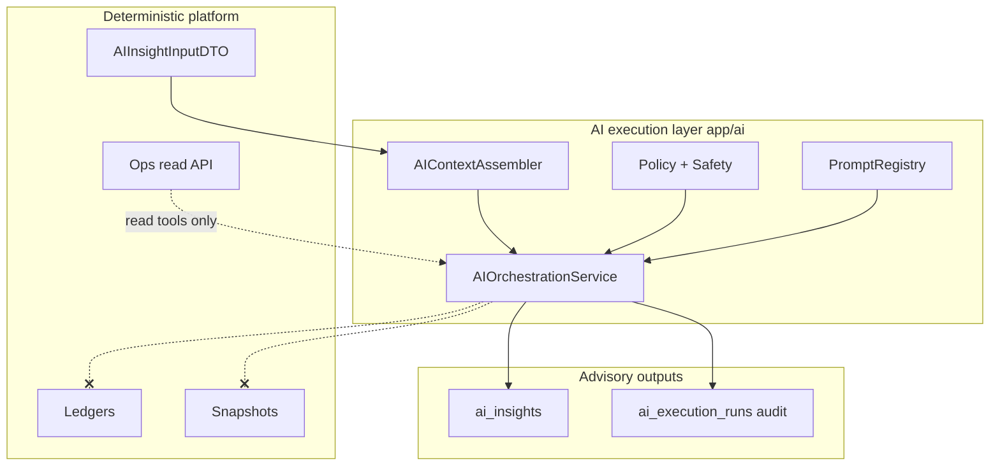

# AI architecture

Governed AI execution layer for marketplace analytics — **not** a chatbot subsystem.

## Position in the platform

## Layers

| Layer | Path | Responsibility |
|-------|------|----------------|
| **Contracts** | `app/dto/analytics_dto.py` | Strict input DTOs (`AIInsightInputDTO`) |
| **Orchestration** | `app/ai/orchestration.py` | Run lifecycle, audit persistence |
| **Context** | `app/ai/context.py` | Tenant + semantics + rebuild-awareness |
| **Agents** | `app/ai/agents.py` | Kinds, tool permissions, escalation |
| **Policy** | `app/ai/policy.py` | Forbidden actions, tool gates |
| **Safety** | `app/ai/safety.py` | Budgets, timeouts, tracing |
| **Prompts** | `app/ai/prompts/` | Versioned prompt contracts |
| **Audit** | `app/models/ai_execution.py` | `ai_execution_runs` metadata |

## Execution lifecycle

1. **Request** — API/service calls `AIOrchestrationService.begin_run()` (future HTTP route).
2. **Policy** — `AI_ENABLED`, agent permissions, forbidden actions.
3. **Context** — `AIContextAssembler` validates semantics; flags degraded if rebuild in flight.
4. **Execute** — Future LLM adapter (out of scope) uses trace + read-only tools.
5. **Complete** — `complete_run()` / `fail_run()` persists audit row + structured logs.

## AI-to-platform interaction rules

| Rule | Detail |
|------|--------|
| Read path | Services/DTO/ops projections only |
| Write path | `ai_insights` drafts only where agent permitted |
| No ledger | `AIAction.MUTATE_LEDGER` forbidden |
| No rebuild trigger | Use `SemanticsInvalidationService` via human/API — not AI |
| No queue claim | ETL worker owns `etl_jobs` |
| Tenant scope | `TenantSession` + RLS on all AI tables |
| Semantics | `assert_rebuild_allowed` before probabilistic generation |

## Tool invocation model

Tools are **named capabilities** (`ToolName`) enforced by `AgentPermissions` — not raw SQL or ORM access from prompts.

Implementations live in future `app/ai/tools/` adapters that call existing services.

## Operational guarantees

- **Advisory by default** — AI text does not change financial truth.
- **Auditable** — every run → `ai_execution_runs` + `ai_*` log events.
- **Isolated failure** — run failure does not roll back ETL/rebuild.
- **Disable switch** — `AI_ENABLED=false` hard stop.
- **Degraded mode** — rebuild in flight → probabilistic sections flagged degraded.

See: [ai_governance.md](ai_governance.md), [agent_model.md](agent_model.md), [ai_safety.md](ai_safety.md).
