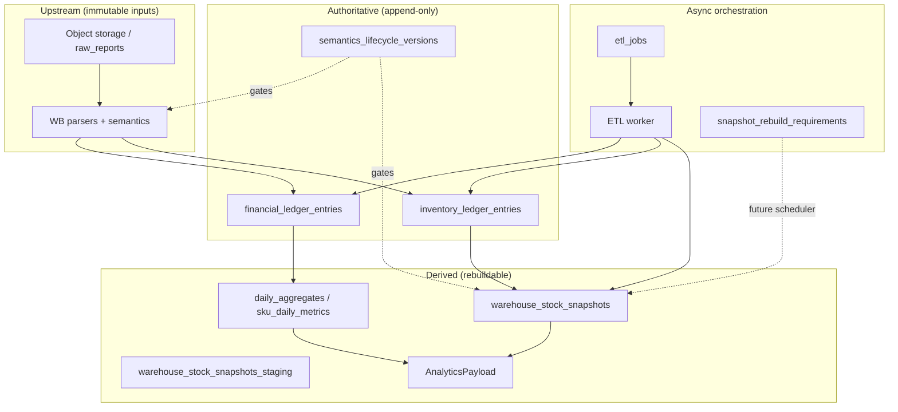

# Platform domain map

Formal bounded contexts for the marketplace analytics platform. **No redesign** — this document names what already exists so evolution stays controlled.

## Bounded contexts

| Context | Package roots | Owns | Authority |
|---------|---------------|------|-----------|
| **Tenant & access** | `app/api`, `app/services/auth_service`, `app/core/security*` | JWT, user identity, RLS session binding | `users`, session context |
| **Report ingest** | `app/api/reports`, `app/services/report_service`, `app/storage` | Raw file storage, `reports`, upload orchestration | `raw_reports`, `reports` |
| **Financial ledger** | `app/domain/finance`, `app/parsers/wb`, `app/etl/wb/persist` | Normalized rows → `financial_ledger_entries` | Ledger tables (append-only) |
| **Inventory ledger** | `app/domain/inventory`, `app/etl/wb/persist` | Movements → `inventory_ledger_entries` | Ledger tables (append-only) |
| **Snapshot reconstruction** | `app/domain/inventory/*`, `app/etl/wb/*rebuild*` | Deterministic snapshot math | Ledger replay order |
| **Snapshot persistence** | `app/etl/wb/inventory_snapshot_*`, `inventory_snapshot_store` | Staging, promote, incremental window | Live/staging snapshot tables (derived) |
| **Semantics governance** | `app/domain/semantics`, `app/parsers/wb/semantics*`, `app/services/semantics_*` | Version lifecycle, ingest/rebuild gates | `semantics_lifecycle_versions`, registry |
| **Job queue** | `app/core/queue`, `app/etl/worker`, `app/models/job` | `etl_jobs` lifecycle | `etl_jobs.status` (Q-STATE-SOT) |
| **Data quality & anomalies** | `app/domain/data_quality`, `app/etl/anomaly_*` | Validation drafts, quarantine persist | `etl_anomalies` (best-effort) |
| **Integrity & drift** | `app/etl/wb/inventory_consistency_*` | Read-only checks, escalation metadata | `snapshot_consistency_checks` |
| **Analytics materialization** | `app/domain/analytics`, `app/dto` | Aggregates, API payloads | `daily_aggregates`, `sku_daily_metrics` |
| **Operations & recovery** | `app/operations`, `app/api/ops`, `app/services/ops_service` | Orchestration metadata, explicit recovery | Ops tables + read APIs |
| **Platform infrastructure** | `app/core`, `app/models`, `alembic` | Config, observability, ORM, migrations | Schema + RLS policies |

## Context diagram



## Upstream / downstream

| Upstream | Downstream | Contract |
|----------|------------|----------|
| Raw file + parser version | Normalized rows | Parser output types; no DB in parser |
| Normalized rows | Ledger entries | Idempotency keys; Decimal money |
| Ledger | Snapshots | LED-REPLAY-ORDER, semantics version on rows |
| Snapshots | Analytics DTO | Fingerprints stable under replay |
| Semantics registry | Ingest + rebuild | SEM-NO-SILENT-FALLBACK |
| `etl_jobs` | Worker persist | QueueSession vs TenantSession |
| Invalidation service | Rebuild requirements | No inline full rebuild on API |

**Rule:** downstream contexts must tolerate full rebuild of derived state without mutating upstream ledgers.

## Anti-corruption layers

| Boundary | ACL | Purpose |
|----------|-----|---------|
| Parser → domain | `NormalizedWbRow`, movement drafts | File columns never leak into ledger math |
| Domain → ETL | Draft types, fingerprints, pure services | ETL owns transactions; domain owns formulas |
| Queue → business | Denormalized fields on `etl_jobs` | Broker never reads `reports` for claim |
| Ops API → ETL | Read-only SQL projections | No rebuild/persist via HTTP ops routes |
| Registry → replay | `SEMANTICS_REGISTRY.resolve` | No implicit “latest” during rebuild |

## Shared kernel

Shared types used across contexts (change requires ADR + invariant review):

| Kernel | Location | Consumers |
|--------|----------|-----------|
| Money / Decimal types | `app/domain/finance/types` | Finance, inventory cost |
| Inventory enums | `app/models/inventory/enums` | Domain, parsers, ETL |
| Semantics version string | `app/parsers/wb/semantics` | Parser, domain, models |
| Security sessions | `app/core/security_context` | API, worker, recovery |
| Tenant id (`user_id`) | All tenant tables | RLS, advisory lock namespace |
| Job status enum | `app/models/job` | Queue, ops, recovery |

**Pragmatic note:** domain imports model **enums** and row-shaped types for mapping — not ORM sessions. See [ownership_model.md](ownership_model.md).

## Cross-domain contracts

| Contract | Document |
|----------|----------|
| System invariants | [invariants.md](invariants.md) |
| Layer dependencies | [dependency_rules.md](dependency_rules.md) |
| Extension points | [extension_contracts.md](extension_contracts.md) |
| Transaction ownership | [boundaries.md](boundaries.md), [platform_layers.md](platform_layers.md) |

## Dependency flow (allowed)

```
api → services → etl → domain
                  ↓      ↑
              parsers ───┘
api → schemas (DTO only)
etl → models, core
operations → models, core (explicit recovery only)
domain → parsers (semantics), models (enums/types only)
```

Forbidden directions: [dependency_rules.md](dependency_rules.md).
