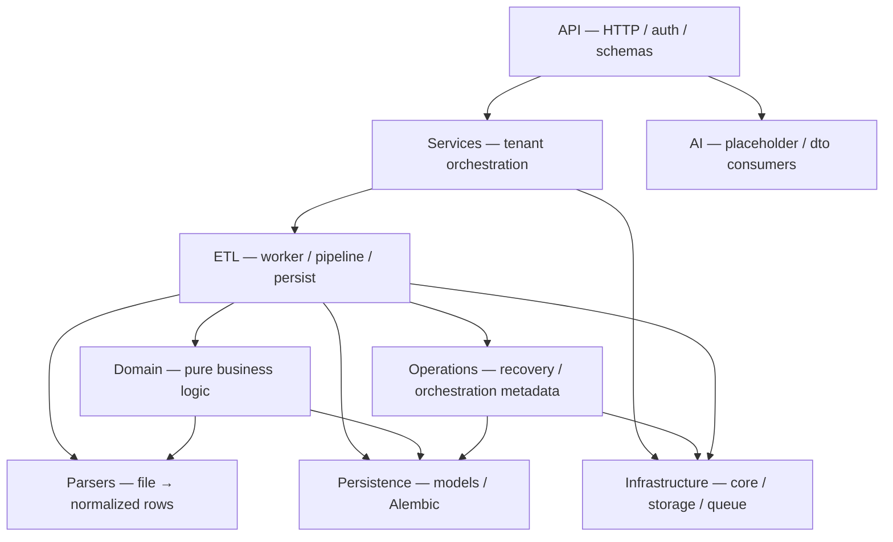
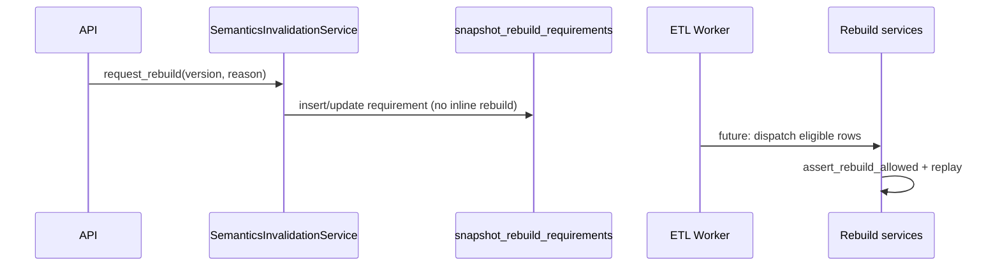

# Platform layers

Vertical structure for call direction and responsibility. Complements [boundaries.md](boundaries.md) and [domain_map.md](domain_map.md).

## Layer stack

## Layer definitions

| Layer | Path | Responsibility |
|-------|------|----------------|
| **API** | `app/api`, `app/schemas` | HTTP contracts, JWT deps, no money math |
| **Services** | `app/services` | Use-case orchestration per tenant |
| **ETL** | `app/etl` | Worker loop, persist, rebuild execution |
| **Domain** | `app/domain` | Ledger math, snapshots, analytics formulas |
| **Parsers** | `app/parsers` | Marketplace file parsing |
| **Semantics** | `app/domain/semantics`, `app/parsers/wb/semantics*` | Version policy + registry |
| **Operations** | `app/operations` | Recovery primitives, rebuild queue metadata, safety guards |
| **Infrastructure** | `app/core`, `app/storage` | Config, RLS sessions, queue, observability |
| **Persistence** | `app/models`, `alembic` | ORM mapping, migrations |
| **DTO** | `app/dto` | `AIInsightInputDTO` — deterministic AI input contract |
| **AI execution** | `app/ai` | Governed runs, policy, prompts, audit (`ai_execution_runs`) |

## Allowed call directions

| From | To | Notes |
|------|-----|-------|
| API | Services, Schemas, Core deps | Not `etl.wb` rebuild internals |
| Services | ETL enqueue, Models, Domain | No direct `QueueSession` in API handlers |
| ETL | Domain, Parsers, Models, Core, Operations | Owns transactions |
| Domain | Parsers (types/registry), Models (enums) | No SQLAlchemy session |
| Operations | Core, Models | Explicit recovery; not called from API yet |
| Parsers | Domain types optional | Prefer parser-local types |
| Core/queue | Models (`etl_jobs` only) | No domain imports |
| Any | Infrastructure (core, storage) | Shared utilities |

## Forbidden bypasses

| Bypass | Why forbidden |
|--------|----------------|
| API → `FullInventoryRebuildService` | Rebuild must run in worker/tenant txn with lock |
| API → `PostgresQueueBackend.claim` | Only worker uses queue role |
| Domain → `AsyncSession` / persist | Breaks testability and LED-* invariants |
| Parser → persist / queue | File I/O only upstream |
| Ops HTTP → recovery mutate | Recovery is explicit operator/worker invoked (future endpoint needs ADR) |
| Inline semantics rebuild on upload | SEM-INVALIDATION-QUEUE — use invalidation service |
| Hidden retry in API | Q-* bounded retries in queue only |

## Sync vs async boundaries

| Sync (request/worker thread) | Async (deferred) |
|------------------------------|------------------|
| HTTP upload → enqueue job | Worker claims job |
| CPU parse (`process_content`) outside DB txn | Persist + rebuild in txn |
| Read ops API | `snapshot_rebuild_requirements` consumer (future) |
| Advisory try-lock in rebuild txn | Backoff `next_eligible_at` |

**No hidden background tasks** in API process — worker is the separate process.

## Queue ownership

| Concern | Owner |
|---------|-------|
| Enqueue | `report_service` / pipeline via `TenantSession` |
| Claim / ack / fail / recover | `worker` + `PostgresQueueBackend` (`QueueSession`) |
| Tenant recovery | `TenantRecoveryService` (explicit) |
| Status projection | `report_projection` schemas from `etl_jobs` |

## Rebuild ownership

| Mode | Entry | Lock | Writes |
|------|-------|------|--------|
| Incremental | Post-persist / window | Advisory xact try | Live snapshots |
| Full | Operator/worker job | Advisory xact try | Staging → promote |
| Orchestration metadata | `RebuildOrchestrationService` | N/A | Requirements row only |

## Semantics invalidation flow

Ingest gate (separate path): `WbFinancialProcessor` → `assert_ingest_allowed` before persist.
