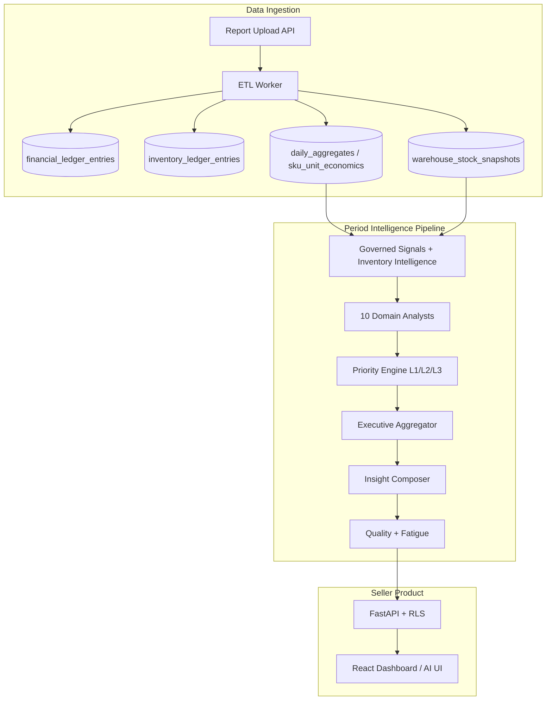

# Marketplace Analytics Platform (WB / Ozon)

**Version:** `v0.6-mvp-intelligence`  
**Status:** Production-ready MVP — Period Intelligence with Inventory Intelligence  
**Last updated:** 2026-06-07

---

## Project Overview

Multi-tenant SaaS platform for Wildberries and Ozon sellers: deterministic financial and inventory analytics, seller-facing dashboard, and **advisory AI** (Period Intelligence).

The platform treats marketplace reports as a **financial data platform** — not a one-off Excel parser:

- **Append-only ledgers** (finance + inventory) as source of truth
- **Governed projections** (aggregates, snapshots) — rebuildable, not authoritative
- **PostgreSQL RLS** — strict tenant isolation
- **AI is advisory only** — never mutates ledgers; degrades confidence when data is incomplete

**Stack:** FastAPI · PostgreSQL 16 · Async SQLAlchemy 2.0 · Alembic · React (Vite) · ETL worker · Optional LLM provider (OpenAI-compatible)

**Primary workflows:**

1. Upload WB realization report (`.xlsx` / `.csv`)
2. ETL → ledger → aggregates → inventory snapshots
3. Import COGS (`cost_history`) for margin/profit trust
4. Period Intelligence AI run → executive summary + actionable recommendations
5. Seller actions: accept / dismiss / complete / snooze

---

## Product Vision

**AI Operational Director for marketplace sellers** — a system that answers:

> *What happened in this period? Why? What should I do first?*

Not a chatbot over raw KPIs. The product combines:

- **Deterministic domain analysts** (revenue, profit, logistics, inventory, …) on governed data
- **Executive Summary** — one primary insight + supporting leads, business-oriented order
- **Business Coverage** — honest disclosure of what data the AI can and cannot see
- **Trust gating** — profit/margin hidden or downgraded when COGS coverage is incomplete
- **Measurable quality** — Seller Usefulness, AI Readiness, Dashboard Echo, Actionable Rate

**North star:** every recommendation must be **actionable**, **grounded in ledger data**, and **prioritized for seller decisions** — revenue and profit first, inventory escalated only when critical.

---

## Current AI Capabilities

### Revenue Intelligence

- Period revenue, top SKU concentration, period-over-period change
- Findings: `sales_top_sku`, `sales_revenue_present`, `revenue_drop` / `revenue_growth`, `concentration_top1_risk`
- **Primary insight candidate** (L1) when data supports it
- Source: `daily_aggregates`, `sku_daily_metrics`, governed signals

### Profit Intelligence

- Net profit, margin %, ROI (with COGS trust gating)
- Findings: `sales_low_margin`, `profit_drop`, deep period insights (unprofitable SKUs)
- Source: `sku_unit_economics_daily`, `cost_history`

### Marketplace Cost Intelligence

- Commission, logistics, returns, storage, penalties, deductions
- Findings: `logistics_high_share`, `logistics_share_growth`, `returns_high_rate`, `returns_rate_growth`
- Deep insights: high commission SKUs, logistics-heavy SKUs
- Source: `financial_ledger_entries`, unit economics

### Inventory Intelligence *(Phase 6.3.0)*

Deterministic layer over existing tables — **no new integrations**:

| Insight | Finding ID | Signal |
|---------|------------|--------|
| Dead stock | `inventory_dead_stock` | SKUs with stock, no recent sales |
| Slow movers | `inventory_slow_movers` | Low turnover vs sales velocity |
| Frozen capital | `inventory_frozen_capital` | Stock × unit cost |
| Stock concentration | `inventory_stock_concentration` | Capital tied to few SKUs |
| Inventory risk | `inventory_risk_high` | Composite risk score |

- Intelligence builder: `app/domain/inventory/intelligence.py`
- Analyst: `app/ai/analysts/inventory.py`
- **Escalation to Primary (L1)** only for critical dead stock or frozen capital ≥ 20% of revenue *(Phase 6.3.0B)*
- Otherwise inventory appears as **supporting domain** (L2) in Executive Summary

### Executive Summary Engine

- Composes title, lead blocks (max 3), reasoning from prioritized findings
- **Revenue-protected primary selection** — inventory wins only if IQ > revenue IQ + 8 pp
- Domain-balanced lead order: Revenue → Profit → Logistics → Returns → Inventory (max 1 slot)
- Semantic deduplication — no duplicate inventory meaning across lead slots
- Module: `app/ai/executive/aggregator.py`, `app/ai/insights/composer.py`

### Insight Engine

- **10 domain analysts:** Sales, RevenueChange, Logistics, Returns, Concentration, Ads (stub), Inventory, Funnel, MarketplaceComparison, Anomaly
- Governed signals: `app/ai/analysts/governed_signals.py`
- Deep period insights: `app/ai/deep/period_insights.py`
- Priority levels L1 / L2 / L3: `app/ai/insights/priority_engine.py`
- Output format: Что / Почему / Уверенность / Действие
- Quality + fatigue: `app/ai/product/fatigue.py`, recommendation audit

### Coverage Engine

**Business Coverage V1** (`app/ai/coverage/business_coverage.py`):

| Block | Weight | Status |
|-------|--------|--------|
| Sales | 12 | ✅ ON |
| Marketplace costs | 14 | ✅ ON |
| COGS & margin | 14 | ✅ ON |
| Inventory | 10 | ✅ ON (partial — snapshots from WB finance) |
| Advertising | 12 | ❌ OFF |
| External marketing | 10 | ❌ OFF |
| Tax | 10 | ❌ OFF |
| OPEX | 10 | ❌ OFF |
| Financial expenses | 8 | ❌ OFF |

**Score:** 50% (12+14+14+10) — persisted in `action_plan.business_coverage`, shown in recommendation UI.

---

## Current Metrics

Pilot audit: 4 WB finance reports, user `caefecb3-5789-4878-a9d4-929be573fbcc`  
Audit script: `scripts/phase_630_inventory_audit.py` → `reports/phase_630_inventory_audit.json`

| Metric | 6.2.2 | 6.3.0 | **6.3.0B (current)** | Target |
|--------|-------|-------|----------------------|--------|
| **Seller Usefulness** | 74.1 | 68.2 ↓ | **80.3** | ≥ 74 ✅ |
| **AI Readiness** | 85.7 | 85.3 | **86.1** | ≥ 86 ✅ |
| **Business Coverage V1** | 50% | 50% | **50%** | — |
| **Dashboard Echo** | 0% | 0% | **0%** | 0% ✅ |
| **Actionable Rate** | 100% | 100% | **100%** | 100% ✅ |
| Inventory Insight Rate | 0% | 100% | **100%** | preserve ✅ |
| Inventory Sub-Coverage | 25% | 75% | **75%** | — |
| Primary Insight Quality | 84.2 | 77.5 | **91.2** | — |
| Trustworthiness | 87.5 | 87.5 | **87.5** | — |

**Release decision:** GO — ready for `v0.6-mvp-intelligence` tag.

---

## Architecture Overview



| Layer | Key modules | Responsibility |
|-------|-------------|----------------|
| **Domain** | `app/domain/finance/`, `app/domain/inventory/` | Money rules, ledger semantics, inventory intelligence |
| **ETL** | `app/etl/worker.py`, `app/etl/wb/` | Parse WB reports, append ledger, rebuild projections |
| **Analytics** | `app/services/analytics_*` | Read APIs, KPI, economics, inventory economics |
| **AI Engine** | `app/services/ai_service.py`, `app/ai/` | Period Intelligence, analysts, executive, persistence |
| **Product** | `app/ai/product/` | Seller usefulness, prioritization, fatigue, today's focus |
| **Frontend** | `frontend/` | Dashboard, reports, costs, AI recommendations |

**Production path:** `AIIntelligenceEngine` via `AIService.run_intelligence`  
**Not in production:** Operating Director scaffold (`app/ai/director/`) — planned Phase 6.3.4

**Architectural invariants:** [docs/architecture/invariants.md](docs/architecture/invariants.md)  
**Phase 6.3 blueprint:** [docs/ai/phase_63_architecture_blueprint.md](docs/ai/phase_63_architecture_blueprint.md)

---

## Supported Domains

### Implemented (production)

| Domain | Analytics UI | AI Insights | Data source |
|--------|-------------|-------------|-------------|
| Revenue / Sales | ✅ Dashboard, Trends | ✅ L1 primary | WB realization report |
| Profit / Margin | ✅ Economics | ✅ Trust-gated | Ledger + `cost_history` |
| MP costs (commission, logistics, returns) | ✅ Economics, reconciliation | ✅ L1/L2 | Ledger |
| Inventory (stock, frozen capital, risk) | ✅ Inventory economics | ✅ L2 default, L1 escalated | Snapshots + ledger |
| SKU unit economics | ✅ Economics drilldown | ✅ Deep insights | Rebuild projections |
| Anomalies / data quality | ✅ Integrity signals | ✅ Warnings | Reconciliation, drift checks |
| Business Coverage disclosure | ✅ AI detail badge | ✅ Persisted | Coverage V1 engine |

### Roadmap (not implemented)

| Domain | Blocker | Planned phase |
|--------|---------|---------------|
| Advertising (spend, ACOS, DRR) | Ads report / column often empty | **6.3.1** |
| Tax (УСН, НДС) | No import tables | **6.3.2** |
| OPEX (payroll, rent) | No import tables | **6.3.2** |
| Conversion (card views, cart, CTR) | No funnel/import tables | **6.3.3** |
| Operating Director (multi-agent) | Scaffold only | **6.3.4** |
| Ozon parser | Placeholder ETL | Post-6.3 |
| Live WB/Ozon API sync | Not in MVP | Future |

---

## Roadmap

### 6.4.0 — Documentation & Release Hardening *(current)*

- README cutover + documentation migration (Phase 6.4.0–6.4.2)
- Tag `v0.6-mvp-intelligence` *(pending approval)*
- Production audit monitoring (primary domain distribution)
- Weekly Analysis page wiring (product backlog)

### 6.3.1 — Advertising Intelligence

- Activate ads spend from ledger / dedicated report
- Apply **revenue protection** pattern from 6.3.0B
- Coverage block: Promotion on MP (weight 12)

### 6.3.2 — Tax & OPEX Intelligence

- Manual import for tax and operating expenses
- New coverage blocks without breaking V1 formula
- Domain analysts for tax load and OPEX impact on margin

### 6.3.3 — Conversion Intelligence

- Card funnel data import (product views, add-to-cart, card CTR) — distinct from existing Funnel analyst (SKU revenue concentration)
- New conversion metrics tables + domain analyst for listing performance

### 6.3.4 — Operating Director

- Promote `app/ai/director/` from scaffold to shadow-run
- L0 Data Quality → L1 Domain Experts → L2 Cross-Domain → L3 Executive
- Strangler-fig migration from `AIIntelligenceEngine`
- Design: [docs/ai/operating_director_architecture.md](docs/ai/operating_director_architecture.md)

---

## Development Setup

### Prerequisites

- Python 3.11+
- Node.js 20+ (frontend)
- PostgreSQL 16 (local or Docker)
- Optional: OpenAI-compatible API key for real LLM narratives

### Quick start (Linux / macOS)

See also [Windows setup](docs/testing/local_runtime_testing.md#windows) in the local runtime testing guide.

```bash
git clone <repo-url>
cd AIplatform_for_marketplace_analytics

python -m venv .venv
source .venv/bin/activate
pip install -r requirements.txt

cp .env.example .env
# Edit DATABASE_URL, SECRET_KEY; AI_PROVIDER=mock for deterministic local AI

alembic upgrade head

# Terminal 1 — API
uvicorn app.main:app --reload --host 0.0.0.0 --port 8000

# Terminal 2 — ETL worker
python -m app.etl.worker

# Terminal 3 — Frontend
cd frontend && npm install && npm run dev
```

### Docker (all services)

```bash
cp .env.example .env
docker compose up --build
# API: http://localhost:8000/health
# Frontend: http://localhost (nginx)
```

Services: `postgres`, `migrate`, `api`, `worker`, `orchestrator` (optional), `nginx`.

### Environment modes

| Mode | Use case | Storage |
|------|----------|---------|
| `MAIN` | Production (Supabase) | Supabase Postgres + Storage |
| `LOCAL` | Dev / integration | Local Postgres + `uploads/` |

See `.env.example` and [docs/product/local_deployment.md](docs/product/local_deployment.md).

### Key environment variables

| Variable | Purpose |
|----------|---------|
| `DATABASE_URL` | Async PostgreSQL connection |
| `SECRET_KEY` | JWT signing |
| `STORAGE_BACKEND` | `local` or `supabase` |
| `AI_PROVIDER` | `mock` (deterministic) or `openai` |
| `AI_OPENAI_API_KEY` | LLM provider key |
| `AI_ENABLED` | Master AI toggle |

Full list: [docs/operations/environment_variables.md](docs/operations/environment_variables.md) and `.env.example`.

---

## Testing

### Unit tests

```bash
.venv/bin/pytest tests/unit/ -q
```

Key AI test suites:

```bash
pytest tests/unit/test_business_coverage.py \
       tests/unit/test_inventory_intelligence.py \
       tests/unit/test_insight_engine.py \
       tests/unit/test_operating_director_scaffold.py -q
```

### Integration tests (PostgreSQL required)

```bash
# Default integration port 5434 — see docker-compose.integration.yml
pytest tests/integration/ -q
```

Docker integration profile:

```bash
docker compose -f docker-compose.integration.yml up --build
pytest tests/integration/ -q
```

### AI quality audits

```bash
# Phase 6.2 migration audit
.venv/bin/python scripts/phase_621_migration_audit.py --user-id <UUID> --limit 10

# Phase 6.3.0 / 6.3.0B inventory + calibration audit
.venv/bin/python scripts/phase_630_inventory_audit.py --limit 4

# General recommendation quality
.venv/bin/python scripts/ai_recommendation_quality_audit.py --user-id <UUID> --limit 10
```

Reports: `reports/phase_630_inventory_audit.json`, `reports/phase_621_migration_audit.json`

### CI

GitHub Actions runs unit + integration tests on push. Stress benchmarks gated by `RUN_STRESS_TESTS=1`.

---

## Deployment

### Production checklist

1. `ENVIRONMENT_MODE=MAIN`, Supabase `DATABASE_URL` with `?ssl=require`
2. `STORAGE_BACKEND=supabase`, bucket configured
3. `SECRET_KEY` — cryptographically random, ≥ 32 chars
4. `alembic upgrade head` via migrate job
5. API + worker as systemd services (or Docker)
6. Nginx serves frontend from `/var/www/marketplace-analytics`
7. SMTP configured for password reset
8. `AI_PROVIDER=openai` + key (or mock for advisory-only deterministic mode)

### Frontend deploy (VPS)

```bash
bash scripts/deploy-frontend.sh
sudo systemctl restart marketplace-backend   # after API changes
```

Docs: [docs/ops/frontend-deploy.md](docs/ops/frontend-deploy.md)

### Post-deploy validation

```bash
curl -s http://127.0.0.1:8000/health
curl -s http://127.0.0.1/api/v1/system/persistence-status  # JWT required
python scripts/rls_leak_test.py
```

After ledger logic changes:

```bash
python scripts/rebuild_financial_projections.py
```

---

## Seller UX (quick reference)

| Route | Purpose |
|-------|---------|
| `/app/dashboard` | KPI + Period Intelligence entry |
| `/app/reports/upload` | Upload WB report |
| `/app/costs` | COGS import and edit |
| `/app/economics/inventory` | Frozen capital, slow movers, dead stock |
| `/app/ai/recommendations` | AI recommendations list |
| `/app/ai/today` | Today's Focus (priority queue) |

---

## API Surface (summary)

| Area | Prefix |
|------|--------|
| Auth | `/api/v1/auth/*` |
| Reports | `/api/v1/reports/*` |
| Analytics | `/api/v1/analytics/*` |
| Costs | `/api/v1/costs/*` |
| AI | `/api/v1/ai/*` |
| System | `/api/v1/system/*` |

OpenAPI: `http://localhost:8000/docs` (when `DEBUG=true` or enabled).

---

## Documentation Index

| Topic | Document |
|-------|----------|
| AI architecture | [docs/ai/ai_architecture.md](docs/ai/ai_architecture.md) |
| Domain analysts | [docs/ai/domain_analysts.md](docs/ai/domain_analysts.md) |
| Executive intelligence | [docs/ai/executive_intelligence.md](docs/ai/executive_intelligence.md) |
| Usefulness framework | [docs/ai/usefulness_framework.md](docs/ai/usefulness_framework.md) |
| Phase 6.3 blueprint | [docs/ai/phase_63_architecture_blueprint.md](docs/ai/phase_63_architecture_blueprint.md) |
| Phase 6.3.0B calibration | [docs/ai/phase_630b_priority_calibration_report.md](docs/ai/phase_630b_priority_calibration_report.md) |
| Financial semantics | [docs/analytics/financial_semantics.md](docs/analytics/financial_semantics.md) |
| Platform invariants | [docs/architecture/invariants.md](docs/architecture/invariants.md) |
| Local runtime testing | [docs/testing/local_runtime_testing.md](docs/testing/local_runtime_testing.md) |

**Legacy detailed README sections** (ETL internals, ledger semantics, queue architecture, historical phases 1–5) are archived at [docs/archive/README_pre_v06.md](docs/archive/README_pre_v06.md).

---

## Release Notes

**Current release:** [v0.6-mvp-intelligence](docs/release/v0.6-mvp-intelligence.md) (2026-06-07)

Period Intelligence MVP with Inventory Intelligence and priority calibration (Phase 6.3.0B). Key metrics: Seller Usefulness **80.3**, AI Readiness **86.1**, Inventory Insight Rate **100%**, Dashboard Echo **0%**.

Full changelog, upgrade notes, and file list: [docs/release/v0.6-mvp-intelligence.md](docs/release/v0.6-mvp-intelligence.md)

---

## License & Contributing

**License:** Proprietary — all rights reserved. No public license file is distributed with this repository.

For architectural changes, follow [docs/architecture/ai_change_policy.md](docs/architecture/ai_change_policy.md) and the [invariant checklist](docs/architecture/invariants.md) before modifying ETL, ledger, or queue code.
