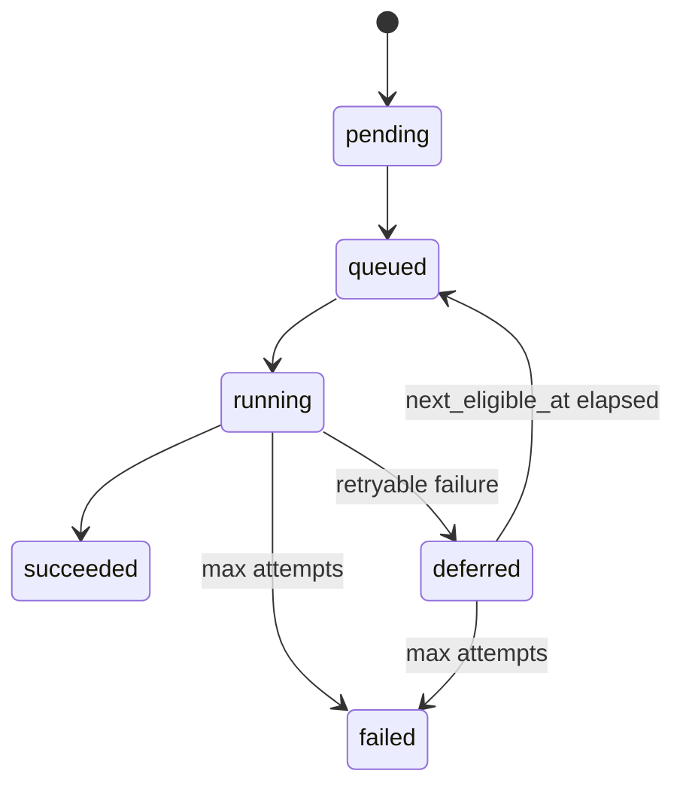

# Operational domain model

Lifecycle states for production operations. **Source of truth** remains existing tables (`etl_jobs`, `snapshot_rebuild_requirements`, etc.).

## Rebuild lifecycle

Orchestration metadata on `snapshot_rebuild_requirements` (migration `0012`):

| State | Meaning |
|-------|---------|
| `pending` | Recorded; not yet dispatched (e.g. semantics invalidation) |
| `queued` | Eligible for worker pickup |
| `running` | Rebuild in progress (holds advisory lock) |
| `succeeded` | Rebuild complete; `requires_rebuild=false` |
| `deferred` | Failed attempt; backoff until `next_eligible_at` |
| `failed` | Exhausted `max_attempts` |

**Modes:** `incremental` (default) | `full` (staging promote).

**Note:** Background consumer for queued rebuilds is **not** deployed yet — transitions via `RebuildOrchestrationService` are foundation for a future worker.

## Queue lifecycle

`etl_jobs.status` (see ADR-006):

`pending` → `processing` → `completed` | `pending` (retry) | `dead_letter`

Worker: `recover_stale()` → `claim()` → CPU ETL → tenant txn persist → `ack()` | `fail()`.

## Anomaly lifecycle

| Layer | Table | When |
|-------|-------|------|
| ETL quality | `etl_anomalies` | After persist, separate txn, best-effort |
| Integrity | `inventory_integrity_anomalies` | Drift verification escalation |

ETL anomalies do not block ledger commit.

## Semantics invalidation lifecycle

1. Operator/API disables or deprecates version → `SemanticsInvalidationService.request_rebuild()`
2. Row inserted: `snapshot_rebuild_requirements`, priority `10`, status `pending`
3. Future rebuild worker processes queue (not inline on API path)

Global registry: `semantics_lifecycle_versions`.

## Drift verification lifecycle

1. `InventoryConsistencyVerificationService` replays ledger slice
2. Writes `snapshot_consistency_checks` (pass/fail + hashes)
3. On mismatch → `inventory_integrity_anomalies` (read-only repair)

Does **not** auto-mutate snapshots.

## Dead-letter lifecycle

`etl_jobs.status = dead_letter` when `attempt_count >= max_attempts` after `fail()` or visibility recovery with exhausted attempts.

Recovery: manual `requeue()` (operator) or new upload — not automatic.

## API visibility

Read-only ops endpoints: `/api/v1/ops/*` (authenticated tenant scope).
