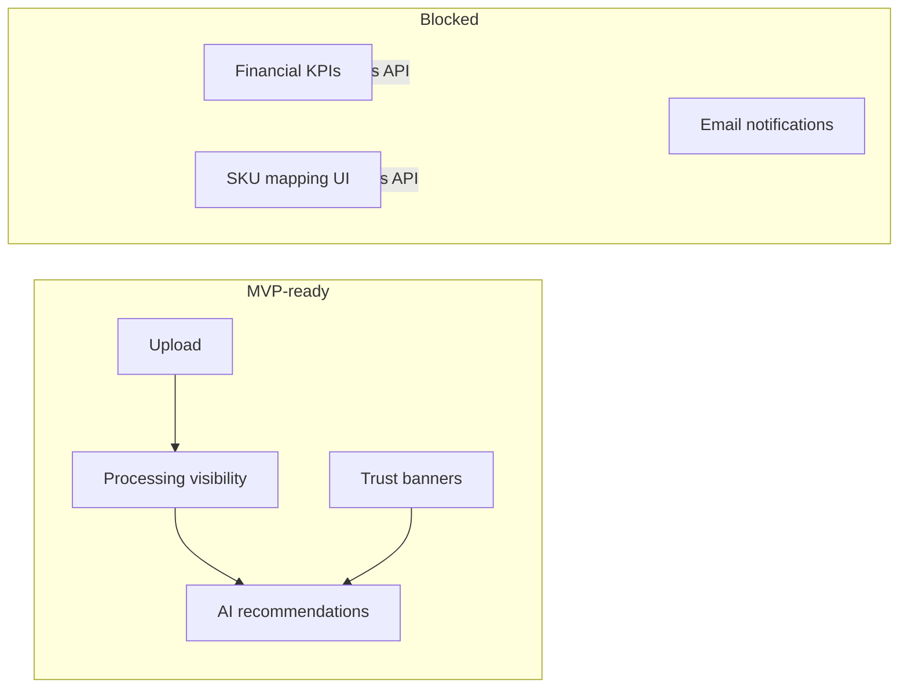

# MVP Readiness Audit (UX-3)

## Executive summary

The platform is **MVP-ready for controlled external usage** as an **operational analytics + AI advisory console** for marketplace sellers who upload reports and act on governed recommendations.

It is **not yet MVP-ready** as a full **financial analytics product** (revenue/profit/margin KPI dashboards) without additional read APIs.

## Maturity classification

| Capability | Classification | External users? | Notes |
|------------|----------------|-----------------|-------|
| Auth (register/login/JWT) | **Stable** | Yes | Tenant isolation via RLS |
| Report upload + lifecycle | **Stable** | Yes | Duplicate checksum handling |
| Report history | **Stable** | Yes | Filters + saved views (local) |
| Cost import | **Stable** | Yes | Enables profitability path |
| Onboarding wizard | **Beta** | Yes | Client-side workspace prefs |
| System status (plain language) | **Stable** | Yes | UX-3 trust layer |
| Trust banners (global) | **Stable** | Yes | Rebuild/queue/AI degraded |
| AI recommendations + feedback | **Beta** | Yes (with caution) | Explainability still raw JSON |
| AI run history | **Beta** | Optional | Hidden in MVP nav |
| Financial KPI dashboard | **Prototype** | No | Missing metrics read APIs |
| SKU mapping UI | **Prototype** | No | Missing mapping CRUD APIs |
| Ops JSON pages (queue/rebuild/drift) | **Internal-only** | No | Hidden in MVP mode |
| Runtime simulation endpoints | **Experimental** | No | Operator tooling |
| Email notifications | **Prototype** | No | Not implemented server-side |
| Server-side tenant settings | **Prototype** | No | LocalStorage for UX-3 |

## What blocks external usage (critical)

1. **No seller KPI read APIs** — revenue/profit/margin/top SKUs/trends
2. **No SKU mapping CRUD APIs** — profitability attribution incomplete
3. **No email/password recovery** — support burden for locked accounts
4. **No server-side tenant settings** — preferences not portable across devices
5. **Raw ops/AI JSON** — requires operator interpretation if exposed

## What requires manual operator support today

- Failed ETL jobs beyond seller re-upload (dead letter triage)
- Semantics version invalidation and rebuild escalation
- Storage/backend configuration (Supabase, worker scaling)
- Interpreting raw explainability payloads for non-technical sellers

## What should stay hidden from users (MVP mode default)

- `/app/ops/*` raw JSON pages (queue, dead letters, rebuilds, drift, semantics)
- `/app/ai/runs` raw run objects (optional beta)
- Runtime simulation and enterprise control plane endpoints
- Internal correlation IDs and raw job payloads (move to Support page only)

MVP mode is configurable in **Settings → Product mode**.

## MVP scope boundaries

**In scope for external MVP:**

- Upload marketplace reports
- Track processing status
- Import costs
- View AI recommendations with transparency notices
- Record feedback (accept/reject + usefulness rating)
- System status in plain language
- Support/debug tenant context

**Out of scope for external MVP:**

- Full financial analytics exploration
- Automated actions on marketplace (pricing/inventory changes)
- Multi-user team roles within tenant
- Billing/subscription management

## Readiness scores (UX-3)

| Dimension | Score (1–10) | Rationale |
|-----------|--------------|-----------|
| **MVP readiness** | **6.5** | Core upload + AI advisory works; KPI gap limits value prop |
| **Production readiness** | **5.5** | Backend mature; product layer needs KPI APIs + auth recovery |
| **AI usefulness** | **6.0** | Feedback loop exists; explainability needs seller-friendly rendering |
| **UX maturity** | **6.5** | Onboarding + trust layer; still some backend-centric JSON |

