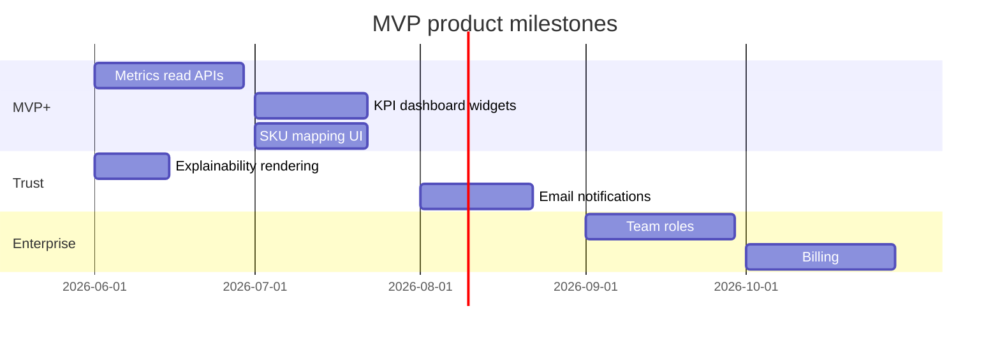

# Product Maturity & MVP Gap Analysis (UX-3)

## 1) Current maturity assessment

| Layer | Maturity | Summary |
|-------|----------|---------|
| Backend platform | **Production-grade** | Governed ETL, ledgers, queue, rebuilds, AI governance |
| Seller frontend | **MVP beta** | Upload, status, AI advisory, onboarding, trust layer |
| Financial analytics UX | **Prototype** | Models exist; read APIs missing |
| Demo/portfolio | **Ready with caveats** | Needs real report file for credible KPI narrative |
| Enterprise ops UI | **Internal-only** | Raw JSON; hidden in MVP mode |

## 2–5) Readiness scores

| Score | Value | Definition |
|-------|-------|------------|
| MVP readiness | **6.5 / 10** | Can onboard external sellers for upload + AI advisory |
| Production readiness | **5.5 / 10** | Missing auth recovery, server settings, KPI APIs |
| AI usefulness | **6.0 / 10** | Actionable with feedback; explainability needs UX rendering |
| UX maturity | **6.5 / 10** | Trust/onboarding solid; reduce JSON exposure |

## 6) Technical debt summary (product layer)

- Client-side only: settings, saved views, usage tracking, notifications
- Raw JSON on ops and explainability pages
- No metrics read endpoints wired to dashboard
- No SKU mapping UI/API
- No email notification delivery
- No password reset / account recovery flow

## 7) Top 10 next priorities

### Critical blockers (must-have for full MVP)

1. **Expose metrics read APIs** — revenue/profit/margin/top SKUs/trends (tenant-scoped projections)
2. **SKU mapping CRUD APIs + UI** — internal ↔ marketplace SKU linking
3. **Seller-friendly explainability rendering** — evidence as links, not JSON blobs
4. **Password recovery flow** — reduce support burden for external users

### Important improvements

5. **Server-side tenant settings** — persist workspace/preferences per tenant
6. **Email/in-app notification delivery** — processing complete, failures, AI approvals
7. **Dashboard KPI widgets** — wire to metrics APIs with staleness timestamps
8. **Report upload error UX** — field-level validation messages from backend

### Future enterprise features

9. **Team roles & audit log** — multi-user tenants, operator actions
10. **Billing & usage metering** — subscription tiers, upload/AI quotas

## Product assumptions (explicit)

- One user account ≈ one tenant (RLS boundary)
- Sellers upload files manually (no marketplace API sync in MVP)
- AI is **read-only advisory** — no automated marketplace mutations
- Operational pages are **visibility only** — no seller-triggered rebuilds
- Financial KPIs are derived from existing aggregates once APIs exist

## Recommended roadmap milestones

## Known limitations (external communication)

- No native Wildberries/Ozon API integration in product UI
- KPI dashboard shows operational signals until metrics APIs ship
- AI recommendations require human verification
- Settings/notifications stored locally until backend tenant prefs exist
- Internal ops tooling available but hidden by default in MVP mode
