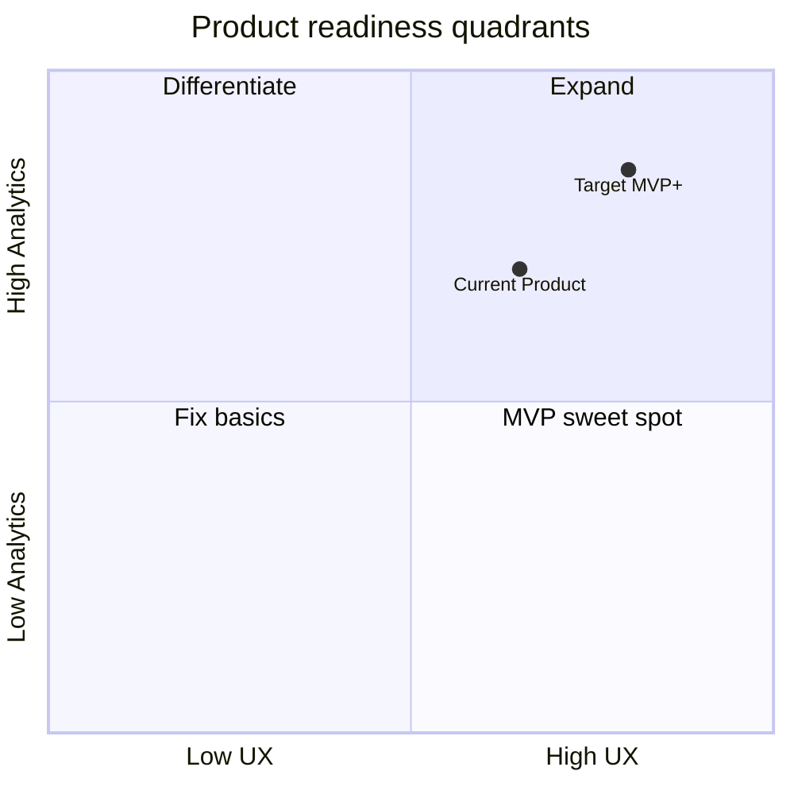

# Product Validation Report (PRODUCT-VALIDATION)

Validation of the platform as a **real working seller product** using realistic workflows and data profiles.

**Scope:** product realism, seller comprehension, operational usability — not architecture expansion.

**Method:** workflow simulation (`scripts/product_validation_simulation.py`), UI walkthrough against route map, API contract review, cross-reference with UX-2/UX-3/ANALYTICS-1/AI-USEFULNESS deliverables.

---

## Validation summary

| Workflow | Simulated | UI-complete | Seller-realistic |
|----------|-----------|-------------|------------------|
| Daily | ✅ | ✅ | **Yes** |
| Weekly | ✅ (API) | ❌ (no page) | **Partial** |
| Incident | ✅ | ⚠️ (Status yes, Ops JSON no) | **Partial** |
| Growth | ✅ (API) | ⚠️ (dashboard partial) | **Partial** |

**Overall:** the platform functions as an **MVP seller product for daily operations + AI advisory**. Weekly/growth analysis requires the next UX sprint (analytics exploration UI).

---

## Readiness scoring (1–10)

Scores reflect **May 2026** state after ANALYTICS-1 + AI-USEFULNESS.

| Dimension | Score | Justification |
|-----------|-------|---------------|
| **1. Seller usability** | **7.0** | Onboarding, upload, dashboard, AI feedback work; weekly UI missing; some ops leakage |
| **2. Analytics usefulness** | **7.0** | Dashboard KPIs live (revenue, profit, trend, top SKUs); period compare/ABC/warehouse API-only |
| **3. AI usefulness** | **6.5** | Quality engine + why/action + evidence cards; reasoning JSON remains; depends on data freshness |
| **4. Workflow clarity** | **6.5** | Daily routine clear; weekly/incident split across Status vs hidden Ops |
| **5. Trust/transparency** | **7.5** | Trust banners, System Status, stale badges, AI trust notice — strong for MVP |
| **6. Operational maturity** | **7.0** (seller-facing) | Backend ops mature; seller UX operational-first but not ops-native |
| **7. Demo readiness** | **7.0** | Demo mode + scripts; needs one real sanitized export for credible KPI story |
| **8. MVP readiness** | **7.0** | External pilot viable for upload + KPI dashboard + AI advisory; gaps below |

### Composite product score

**Weighted average: 6.9 / 10** — suitable for **controlled external MVP** with documented limitations.



---

## Scenario validation results

| Seller profile | Dashboard | AI | Ops clarity | Verdict |
|----------------|-----------|-----|-------------|---------|
| Healthy seller | ✅ | ✅ | ✅ | **Pass** |
| Declining seller | ⚠️ trend only | ⚠️ needs evidence | ✅ | **Partial** — needs period compare UI |
| Inventory chaos | ❌ no WH UI | ⚠️ | ⚠️ anomalies JSON | **Partial** |
| High-return products | ⚠️ margin without returns KPI | ⚠️ | ✅ | **Partial** — needs cost + SKU drilldown |
| Warehouse imbalance | ❌ API only | ⚠️ | ⚠️ | **Fail UI** — API pass |
| Stale inventory | ✅ stale badge | ✅ confidence down | ✅ | **Pass** |
| Margin collapse | ⚠️ needs costs | ✅ | ✅ | **Partial** |
| Seasonal spike | ✅ trend | ⚠️ | ✅ | **Partial** — needs compare UI |

Full profiles: `docs/product/real_seller_scenarios.md`

---

## MVP blockers (remaining)

### Critical (must fix for full seller value prop)

1. **Weekly Analysis UI** — wire period-compare, ABC, inventory-risk, top SKUs by profit
2. **SKU mapping CRUD** — profitability attribution incomplete without it
3. **Password recovery** — support burden for external users
4. **Costs-import nudge** — margin KPIs misleading when costs absent

### Important (near-term)

5. Server-side tenant settings (workspace, marketplace, alerts)
6. Seller-friendly anomalies table (not JSON)
7. Dashboard period selector (7/14/30 days)
8. Email/in-app notification delivery for processing events

### Non-blockers (defer)

- Team roles / audit log
- Billing / metering
- Enterprise runtime simulation UI
- Multi-agent orchestration expansion

---

## What passed validation

- Register/login → onboarding → upload → dashboard KPIs (with freshness)
- AI recommendation list → detail → feedback loop
- Trust layer during stale/degraded conditions
- Duplicate report detection (checksum)
- API-driven weekly/growth analysis (script-validated)
- AI quality: fingerprint dedupe, confidence normalization, stats endpoint

---

## What failed or partially failed

- Weekly workflow entirely in UI (API-only today)
- Warehouse/inventory seller visualization
- Anomalies comprehension without operator training
- Growth workflow without SKU explorer
- Real-data demos with placeholder CSV (no rich aggregates)

---

## Simulation commands

```bash
# Full workflow simulation (API)
python scripts/product_validation_simulation.py --workflow all

# Daily + AI with report
python scripts/ux2_real_data_validation.py \
  --report-file /path/to/real_export.csv \
  --costs-file docs/product/fixtures/sample_costs.csv \
  --run-ai
```

---

## Related docs

- `docs/product/workflow_simulation.md`
- `docs/product/ux_friction_report.md`
- `docs/product/refined_roadmap.md`
- `docs/product/mvp_readiness.md` (UX-3 baseline — superseded scores above)
