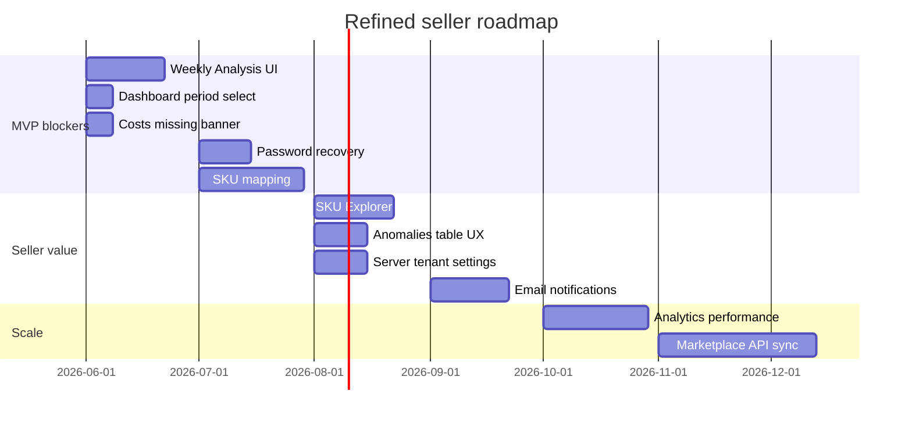

# Refined Roadmap (PRODUCT-VALIDATION)

Roadmap refined from **real workflow simulation**, seller scenario validation, and friction analysis.

**Principle:** maximize seller value per engineering week; defer enterprise complexity that does not unblock daily/weekly seller decisions.

---

## Priority tiers

### Tier 1 — Immediate MVP blockers

| # | Feature | Seller value | Effort | Notes |
|---|---------|--------------|--------|-------|
| 1 | **Weekly Analysis page** | Answers “what changed?” | M | Wire existing analytics APIs: period-compare, ABC, inventory-risk, top SKUs by profit |
| 2 | **Dashboard period selector** | Flexible daily/weekly view | S | 7d / 14d / 30d; reuse existing KPI queries |
| 3 | **Costs missing banner** | Honest margin KPIs | S | Prompt import when costs empty |
| 4 | **Password recovery** | External user self-service | M | Auth flow + email |
| 5 | **SKU mapping CRUD + UI** | Correct profitability | L | Backend + frontend; blocks accurate margin by SKU |

### Tier 2 — Near-term seller value

| # | Feature | Seller value | Effort |
|---|---------|--------------|--------|
| 6 | SKU Explorer / drilldown | Bad SKU identification | M |
| 7 | Warehouse risk card | Inventory chaos profile | S |
| 8 | Anomalies plain-language table | Incident workflow | M |
| 9 | Server-side tenant settings | Cross-device prefs | M |
| 10 | Email notifications (processed/failed) | Reduces status polling | M |
| 11 | Collapse reasoning JSON by default | AI comprehension | S |
| 12 | Rename seller-facing AI labels | Terminology fix | S |

### Tier 3 — Scaling improvements

| # | Feature | Rationale |
|---|---------|-----------|
| 13 | Analytics caching / read replicas | KPI latency at scale |
| 14 | Report upload progress + ETA | Large file UX |
| 15 | Saved views server-side | Reports filters portable |
| 16 | AI recommendation digest (weekly email) | Reduce fatigue |
| 17 | Marketplace API sync (WB/Ozon) | Reduce manual upload friction |

### Tier 4 — Future enterprise (explicitly low priority for seller MVP)

| Item | Why defer |
|------|-----------|
| Multi-agent orchestration expansion | Does not improve seller decisions directly |
| Runtime simulation / control plane UI | Operator tooling; hidden in MVP |
| Autonomous healer expansion | Backend maturity sufficient |
| Team roles & audit log | Single-user tenant assumption holds for MVP |
| Billing / subscription tiers | Post product-market fit |

---

## Unnecessary complexity to avoid (validation finding)

Do **not** prioritize for seller MVP:

- More AI agents or autonomous runtime loops
- Exposing raw ops JSON to default seller nav
- Enterprise forecast/simulation endpoints in product UI
- Rebuilding ledger/orchestration semantics (invariants are stable)

---

## Missing seller-critical capabilities (gap list)

| Capability | Current state | Target |
|------------|---------------|--------|
| Period comparison in UI | API only | Weekly Analysis page |
| Unprofitable SKU identification | API sort=profit | SKU table + explorer |
| Warehouse imbalance view | API only | Dashboard or inventory page |
| Returns impact KPI | Not exposed | Future analytics read model |
| SKU mapping | Guidance only | Full CRUD |
| Cross-device onboarding state | localStorage | Server prefs |

---

## Recommended milestone sequence

---

## Success metrics (post-roadmap)

Track after Tier 1 delivery:

| Metric | Target |
|--------|--------|
| Daily workflow completion time | &lt; 10 min median |
| Weekly questions answered in UI (no support) | &gt; 80% |
| AI recommendation avg rating | &gt; 3.5 / 5 |
| Ignored recommendations (7d) | &lt; 40% |
| Demo-to-signup conversion (portfolio) | qualitative improvement |

API: `GET /api/v1/ai/recommendations/stats` for AI metrics.

---

## Decision log

| Decision | Rationale |
|----------|-----------|
| Prioritize Weekly Analysis UI over new KPI APIs | APIs exist; UX is the bottleneck |
| Keep ops pages internal in MVP | Validation showed JSON harms comprehension |
| Defer enterprise runtime UI | No seller workflow dependency |
| Invest in SKU mapping before billing | Profitability attribution is core value prop |

See full validation: `docs/product/product_validation.md`
