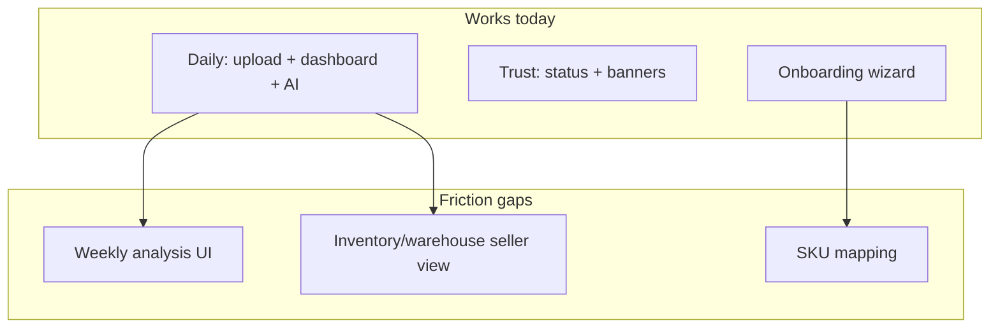

# UX Friction Report (PRODUCT-VALIDATION)

Analysis of seller-facing friction based on simulated workflows (daily, weekly, incident, growth).

---

## Executive summary

The product is **strong for daily operational routine** (upload → dashboard KPIs → AI review) but **weak for weekly deep analysis** because advanced analytics APIs are not yet exposed as seller UI pages.

Trust/transparency (System Status, trust banners, stale indicators) is a differentiator. Remaining friction clusters around **ops language leakage**, **missing weekly analysis UI**, and **client-only settings**.

---

## Friction findings

### 1) Confusing workflows

| Issue | Impact | Severity |
|-------|--------|----------|
| Weekly analysis has no dedicated page | Sellers cannot compare periods or run ABC in UI | **High** |
| Incident path splits between Status (good) and Ops JSON (bad) | Confusion when MVP hides ops nav | **Medium** |
| Onboarding completion is client-local | “Setup done” not synced across devices | **Medium** |
| Costs import optional but margin KPIs depend on it | Misleading profit/margin without costs | **High** |

### 2) Overloaded screens

| Screen | Issue | Recommendation |
|--------|-------|----------------|
| Recommendation detail | Reasoning trace still raw JSON | Keep JSON collapsed; show evidence cards first (partial fix done) |
| Ops pages (queue, rebuilds, drift) | Full JSON payloads | Keep hidden in MVP; never default for sellers |
| Support page | Debug-oriented | OK for support; not for daily sellers |

### 3) Seller terminology problems

| Current | Seller expects | Fix |
|---------|----------------|-----|
| “Processing pipeline” | “Reports being processed” | Rename dashboard card |
| “Semantics version” | Hidden from sellers | Keep in Support/ops only |
| “Explainability” | “Why AI said this” | Rename section heading |
| “Fingerprint” | Internal dedupe ID | Hide or move to Support |

### 4) Hidden actions

| Desired action | Where it hides | Fix |
|----------------|----------------|-----|
| Compare last month vs prior | No UI | Add “Compare periods” widget |
| Find unprofitable SKUs | API only (`sort=profit`) | Add SKU table sort toggle |
| Warehouse risk summary | API only | Add inventory risk card on dashboard or weekly page |
| View AI feedback stats | API only | Optional “AI quality” panel in Support |

### 5) Operational leakage into seller UX

- Trust banners correctly surface rebuild/queue state in plain language ✅
- Anomalies page still reads like operator tooling ⚠️
- Report detail may expose raw job payloads ⚠️
- MVP mode hides ops nav — good default ✅

### 6) AI over-complexity

| Before AI-USEFULNESS | After | Remaining |
|----------------------|-------|-----------|
| Generic advice | why/action templates | Some workflows still verbose |
| Raw evidence JSON | Evidence node cards | Reasoning trace still JSON |
| High confidence without evidence | Confidence penalties | Seller may not understand penalty |

### 7) Onboarding friction

- 8-step wizard can feel long for returning sellers
- SKU mapping guidance is informational only (no CRUD API)
- “First AI analysis” step depends on processed report — timing unclear

---

## Recommended simplifications (prioritized)

### P0 — unblock seller value

1. **Weekly Analysis page** — period compare, ABC summary, inventory risk, top SKUs by profit
2. **Dashboard period selector** — 7d / 14d / 30d instead of fixed 14d
3. **Costs required nudge** — banner when costs missing and margin requested

### P1 — reduce confusion

4. Rename “Explainability” → “Why AI said this”
5. Collapse raw JSON by default on recommendation detail
6. Anomalies: table with plain-language columns (type, date, affected SKU)

### P2 — polish

7. Server-side tenant settings (workspace, marketplace)
8. Email on report processed / failed
9. Password recovery

---

## Workflow cleanup map

See scoring impact in `docs/product/product_validation.md`.
