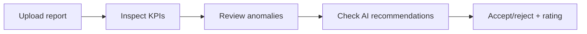
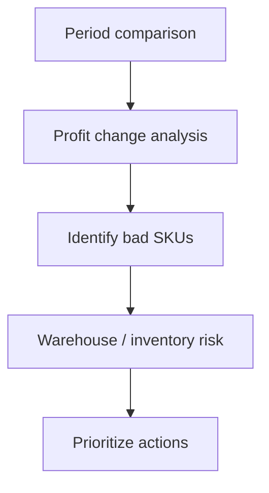
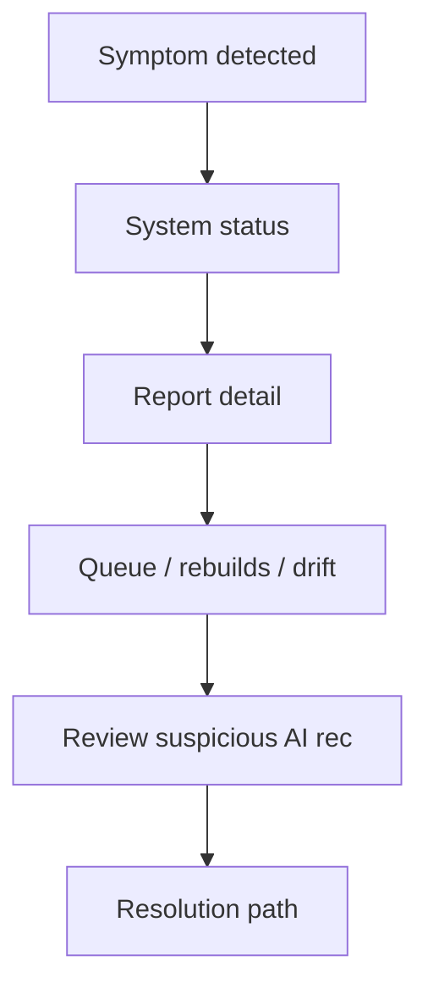

# Workflow Simulation (PRODUCT-VALIDATION)

This document simulates realistic seller operations against the **current product UI + APIs**, without changing backend architecture.

## Simulation harness

Script: `scripts/product_validation_simulation.py`

```bash
python scripts/product_validation_simulation.py --workflow all --run-ai \
  --report-file docs/product/fixtures/sample_report_placeholder.csv
```

Workflows exercised:

| Workflow | API surfaces | Primary UI routes |
|----------|--------------|-------------------|
| Daily | upload, KPI summary, anomalies, recommendations | `/app/dashboard`, `/app/reports/upload`, `/app/ai/recommendations` |
| Weekly | period compare, top SKUs, ABC, inventory risk | APIs exist; **no dedicated weekly UI page yet** |
| Incident | runtime summary, rebuilds, drift, explainability | `/app/status`, `/app/ops/*` (hidden in MVP mode) |
| Growth | top SKUs, ABC, inventory risk, AI stats | Dashboard partial; growth deep-dive **API-only** |

---

## 1) Daily workflow (5–10 min)

**Seller goal:** “What happened since my last report? What should I do today?”



| Step | Action | Route / API | Pass criteria |
|------|--------|-------------|---------------|
| 1 | Upload latest report | `/app/reports/upload` | Clear success/failure; duplicate checksum handled |
| 2 | Inspect KPIs | `/app/dashboard` | Revenue, profit, margin, trend, top SKUs visible |
| 3 | Check processing | `/app/status` or trust banners | Seller understands stale vs fresh |
| 4 | Review anomalies | `/app/ops/anomalies` (MVP: via status narrative) | Anomaly type understandable |
| 5 | Review AI | `/app/ai/recommendations` | Why/action visible; evidence readable |

**Friction observed:** anomaly page uses ops language; MVP mode hides ops routes — sellers rely on System Status + trust banners.

---

## 2) Weekly workflow (30–60 min)

**Seller goal:** “How did this period compare? Which SKUs hurt profit? Any warehouse issues?”



| Step | Action | API | UI status |
|------|--------|-----|-----------|
| Compare periods | Last 14d vs prior 14d | `GET /analytics/kpis/period-compare` | **Not wired to UI** |
| Profit changes | Trend + summary deltas | `GET /analytics/kpis/trends/daily`, period-compare | Partial (dashboard trend only) |
| Bad SKUs | Sort by profit | `GET /analytics/kpis/top-skus?sort=profit` | Dashboard shows top-5 by revenue only |
| Warehouse issues | Discrepancy risk | `GET /analytics/kpis/inventory-risk`, `/warehouses` | **No seller page** |
| ABC segmentation | Focus A/B/C | `GET /analytics/kpis/abc` | **No seller page** |

**Validation result:** weekly analysis is **API-complete but UX-incomplete**. Power users can validate via script; typical sellers cannot complete weekly workflow entirely in UI.

---

## 3) Incident workflow (problem investigation)

**Seller goal:** “Something is wrong — is it my file, processing, data freshness, or AI?”



| Incident type | Symptom | Where to investigate | Seller comprehension |
|---------------|---------|----------------------|----------------------|
| Broken report | Upload failed / `failed` status | `/app/reports/:id` | Good — status badges |
| Stale analytics | KPIs marked stale | Dashboard badge + `/app/status` | Good after UX-3 trust layer |
| Failed rebuild | Data not updating | `/app/status`, ops rebuilds | Partial — plain language on status page |
| Suspicious AI | Low confidence / no evidence | Recommendation detail + explainability | Improved (AI-USEFULNESS) |
| Inventory anomaly | Stock mismatch | `/app/ops/anomalies`, drift checks | Weak — ops JSON if exposed |

**Validation result:** incident workflow works best when sellers stay on **System Status + Report detail + AI detail**. Raw ops pages remain operator-grade.

---

## 4) Growth workflow (optimization)

**Seller goal:** “Where can I grow revenue, fix margin, optimize stock?”

| Step | Signal | API | UI |
|------|--------|-----|-----|
| Growth opportunities | Top revenue SKUs, A-bucket | top-skus, abc | Dashboard top-5 revenue |
| Stock optimization | Warehouse discrepancies | inventory-risk, warehouses | Not in UI |
| Margin improvement | Low-margin SKUs, period delta | top-skus (profit), period-compare | Partial |

**Validation result:** growth insights exist at API layer; product needs a **Weekly Analysis** or **SKU Explorer** page to be seller-realistic.

---

## Simulation checklist

Record for each run:

- [ ] Time to complete daily workflow
- [ ] Can seller explain KPI freshness without ops training?
- [ ] Can seller complete AI feedback loop in &lt; 2 min?
- [ ] Can weekly questions be answered without calling support?
- [ ] Incident self-diagnosis success (yes/no/partial)

See also: `docs/product/seller_evaluation_scenarios.md` (AI phase) and `docs/product/real_seller_scenarios.md` (data profiles).
