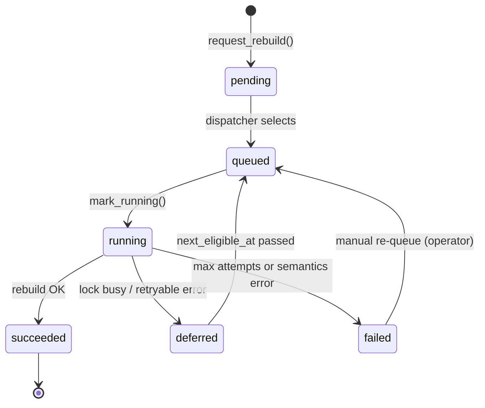

# Orchestration lifecycle

State machine for `snapshot_rebuild_requirements.orchestration_status`.

## States

## Transitions (code owners)

| Transition | Service | Notes |
|------------|---------|-------|
| → `pending` | `SemanticsInvalidationService` | Upload/semantics path |
| → `queued` | `RebuildOrchestrationService.mark_queued` | Dispatcher pre-run |
| → `running` | `mark_running` | Increments `attempt_count` |
| → `succeeded` | `mark_succeeded` | Clears `requires_rebuild` |
| → `deferred` | `mark_failed` or `mark_deferred_lock_busy` | Backoff scheduled |
| → `failed` | `mark_failed` | Terminal when attempts exhausted |
| Stale `running` | `TenantRecoveryService` / `RetrySupervisor` | Crash recovery |

## Lock-busy path

When `InventoryRebuildBusyError` (persist path or another rebuild holds advisory lock):

1. `mark_deferred_lock_busy` — **does not** consume retry attempt
2. `next_eligible_at = now + orchestrator_defer_busy_seconds`
3. Log: `runtime_rebuild_deferred_busy`

## Coexistence with persist-time rebuild

ETL persist may still run **incremental** rebuild inline (existing behavior). Orchestrator consumes **queued requirements** from semantics invalidation and operator requests without blocking the API.

**Contention:** advisory lock ensures one rebuild per tenant; orchestrator defers if persist holds the lock.

## Idempotency

- Re-dispatching `succeeded` rows: skipped (`is_eligible_for_dispatch` false)
- Concurrent orchestrators: fair batch + DB state checks; second worker gets `skipped` outcome

## Graceful shutdown

Orchestrator checks `_shutdown` between cycles (SIGINT/SIGTERM). In-flight rebuild completes current transaction before exit (no mid-promote kill from orchestrator signal during `dispatch_once` — use process supervisor grace period).
