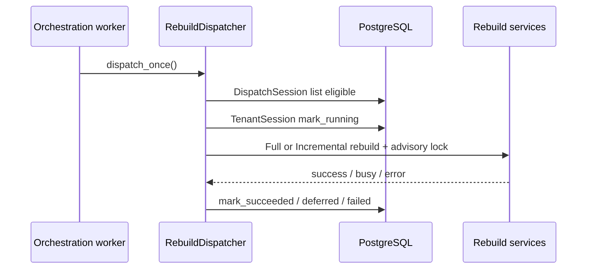

# Runtime architecture

Production runtime automation built incrementally on existing queue, rebuild, and recovery primitives.

## Processes

| Process | Module | Responsibility |
|---------|--------|----------------|
| **API** | `app.main` | HTTP, upload, read models |
| **ETL worker** | `app.etl.worker` | `etl_jobs` claim → parse → persist → ack |
| **Orchestrator** | `app.runtime.orchestration_worker` | Rebuild requirements dispatch + maintenance |

No distributed scheduler framework — each process runs an explicit `while` loop with poll intervals and graceful shutdown.

## Rebuild dispatch path

## Session model

| Session | Use |
|---------|-----|
| `DispatchSession` | Cross-tenant **read** of `snapshot_rebuild_requirements`, queue metrics |
| `TenantSession` | Rebuild execution, orchestration mutations per `user_id` |
| `QueueSession` | ETL job broker (ETL worker only) |

**Rule:** dispatch never mutates tenant data under `DispatchSession`.

## Components

| Component | Path |
|-----------|------|
| Dispatcher | `app/runtime/rebuild_dispatcher.py` |
| Retry supervisor | `app/runtime/retry_supervisor.py` |
| Observability | `app/runtime/observability.py` |
| Runtime guards | `app/runtime/runtime_guards.py` |
| Recovery (existing) | `app/operations/recovery.py` |

## Invariants preserved

- Append-only ledger (rebuild read-only)
- Deterministic replay (existing rebuild services)
- Staging promote atomicity (full rebuild unchanged)
- `pg_try_advisory_xact_lock` per tenant
- RLS: tenant mutations only under `TenantSession`
- No hidden retries (explicit backoff + `max_attempts`)

See also: [scheduling_model.md](scheduling_model.md), [orchestration_lifecycle.md](orchestration_lifecycle.md).
