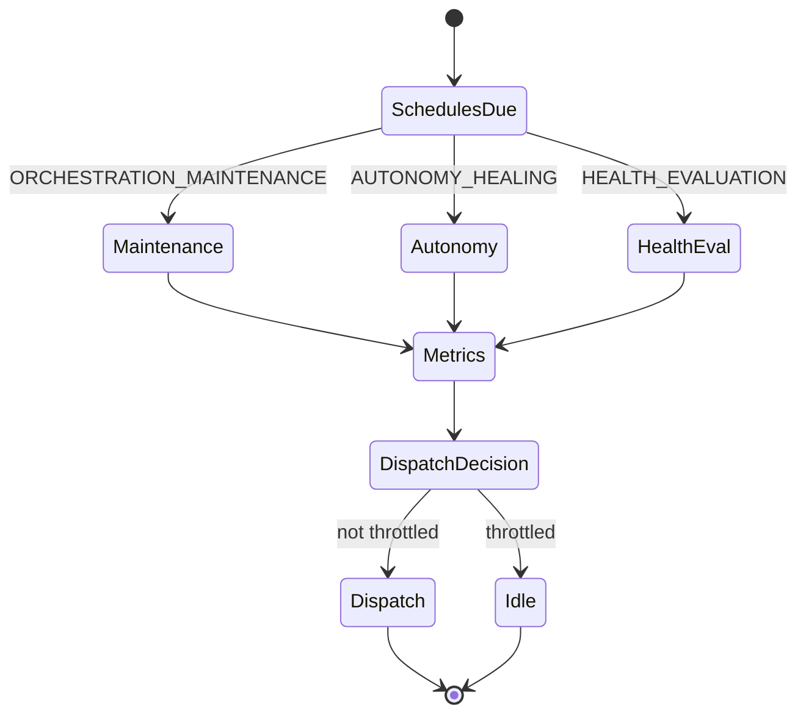

# Runtime lifecycle

## Orchestrator cycle

## Rebuild requirement (unchanged authority)

Append-only semantics invalidation creates requirements. Orchestrator transitions: `pending` → `running` → `succeeded` | `deferred` | `failed`. Advisory lock busy → `deferred` without consuming attempt.

## Incremental → full escalation

When `attempt_count >= RUNTIME_INCREMENTAL_TO_FULL_AFTER_ATTEMPTS`, dispatch upgrades `rebuild_mode` to `full` before execution (explicit flush, logged).

## Degraded modes

| Severity | Effect |
|----------|--------|
| WARN | Ops recommendations; dispatch may continue |
| CRITICAL | Throttle dispatch; tenant state `overloaded` |
| Queue overload | `should_throttle_dispatch` blocks new rebuild dispatch |

## Recovery

- **Stale RUNNING**: `RetrySupervisor` + optional `auto_reset_stale_rebuilds` autonomy event.
- **Stuck PROCESSING jobs**: `TenantRecoveryService` per tenant sample.
- **Tenant queue pressure**: `auto_defer_overloaded_tenant` (reversible defer).

All autonomous actions write to `runtime_autonomy_events` with `correlation_id`.
